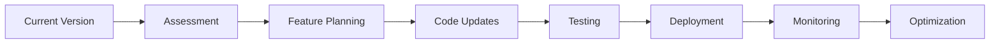

# RevitPy Migration Guide

## Overview

This guide provides detailed instructions for migrating RevitPy projects between different Revit versions, helping developers update their code to take advantage of new features while maintaining backward compatibility.

## Table of Contents

- [Migration Overview](#migration-overview)
- [Version-Specific Migrations](#version-specific-migrations)
- [Code Modernization](#code-modernization)
- [Feature Adoption](#feature-adoption)
- [Performance Optimization](#performance-optimization)
- [Testing Migration](#testing-migration)
- [Deployment Considerations](#deployment-considerations)
- [Rollback Procedures](#rollback-procedures)

## Migration Overview

### Migration Strategy

RevitPy follows a **gradual migration approach** that allows you to:

1. **Maintain compatibility** with existing Revit installations
2. **Adopt new features** incrementally
3. **Optimize performance** for newer versions
4. **Ensure reliability** through comprehensive testing

### Migration Timeline



### Pre-Migration Checklist

- [ ] **Version Assessment**: Identify current and target Revit versions
- [ ] **Feature Audit**: Catalog features used in current implementation
- [ ] **Dependency Review**: Check third-party library compatibility
- [ ] **Performance Baseline**: Establish current performance metrics
- [ ] **Test Coverage**: Ensure comprehensive test suite exists
- [ ] **Backup Strategy**: Create rollback plan and data backups
- [ ] **User Communication**: Plan user notification and training

## Version-Specific Migrations

### Migrating from Revit 2022 to 2023

#### Key Changes in Revit 2023

1. **Modern Transaction API**: Enhanced transaction performance and reliability
2. **Improved Parameter Access**: Type-safe parameter operations
3. **Enhanced Geometry Precision**: Better floating-point accuracy
4. **Async Operation Support**: Non-blocking operations for better UI responsiveness

#### Migration Steps

##### 1. Update Transaction Handling

**Before (Revit 2022):**
```python
def create_wall_legacy(doc, start_point, end_point, level):
    transaction = Transaction(doc, "Create Wall")
    transaction.Start()
    try:
        line = Line.CreateBound(start_point, end_point)
        wall = Wall.Create(doc, line, level, False)
        transaction.Commit()
        return wall
    except Exception as e:
        transaction.RollBack()
        raise e
```

**After (Revit 2023+):**
```python
async def create_wall_modern(api, start_point, end_point, level):
    """Create wall using modern transaction API."""
    wall_params = WallCreationParameters(
        start_point=start_point,
        end_point=end_point,
        level=level,
        structural=False
    )
    
    async with api.transaction_manager.modern_transaction("Create Wall"):
        return await api.element_manager.create_wall_async(wall_params)
```

**Compatibility Wrapper:**
```python
async def create_wall_compatible(api, start_point, end_point, level):
    """Create wall with version compatibility."""
    if api.supports_feature("ModernTransactions"):
        return await create_wall_modern(api, start_point, end_point, level)
    else:
        return await create_wall_legacy_async(api, start_point, end_point, level)
```

##### 2. Update Parameter Access

**Before (Revit 2022):**
```python
def set_wall_height(wall, height):
    height_param = wall.get_Parameter(BuiltInParameter.WALL_HEIGHT_TYPE)
    if height_param and not height_param.IsReadOnly:
        height_param.Set(height)
        return True
    return False
```

**After (Revit 2023+):**
```python
async def set_wall_height_modern(api, wall, height):
    """Set wall height using modern parameter API."""
    return await api.parameter_manager.set_parameter_value_async(
        wall, "Height", height
    )
```

**Compatibility Implementation:**
```python
async def set_wall_height_compatible(api, wall, height):
    """Set wall height with version compatibility."""
    try:
        return await api.parameter_manager.set_parameter_value_async(
            wall, "Height", height
        )
    except NotSupportedException:
        # Fall back to legacy method
        return set_wall_height_legacy(wall, height)
```

##### 3. Implement Async Patterns

**Before (Synchronous):**
```python
def process_walls(walls):
    results = []
    for wall in walls:
        result = process_single_wall(wall)
        results.append(result)
    return results
```

**After (Asynchronous):**
```python
async def process_walls_async(api, walls):
    """Process walls asynchronously for better performance."""
    tasks = []
    for wall in walls:
        task = process_single_wall_async(api, wall)
        tasks.append(task)
    
    return await asyncio.gather(*tasks)
```

##### 4. Migration Script Example

```python
#!/usr/bin/env python3
"""
Migration script from Revit 2022 to 2023
Converts legacy RevitPy code to use modern APIs
"""

import asyncio
import logging
from pathlib import Path
from revitpy.compatibility import get_api_adapter, RevitVersion
from revitpy.migration import LegacyCodeConverter

async def migrate_project_to_2023():
    """Migrate project from Revit 2022 to 2023."""
    
    # Setup logging
    logging.basicConfig(level=logging.INFO)
    logger = logging.getLogger(__name__)
    
    logger.info("Starting migration from Revit 2022 to 2023")
    
    # Get API adapter for target version
    api = await get_api_adapter(target_version=RevitVersion.Revit2023)
    
    # Initialize code converter
    converter = LegacyCodeConverter(
        source_version=RevitVersion.Revit2022,
        target_version=RevitVersion.Revit2023
    )
    
    # Convert transaction patterns
    logger.info("Converting transaction patterns...")
    await converter.convert_transactions(
        source_dir="src/",
        patterns=["Transaction(", "transaction.Start()", "transaction.Commit()"]
    )
    
    # Convert parameter access
    logger.info("Converting parameter access patterns...")
    await converter.convert_parameter_access(
        source_dir="src/",
        patterns=["get_Parameter(", ".Set(", ".AsDouble()"]
    )
    
    # Update imports
    logger.info("Updating imports...")
    await converter.update_imports(
        source_dir="src/",
        import_mappings={
            "from Autodesk.Revit.DB import Transaction": 
            "from revitpy.compatibility import get_api_adapter",
            
            "from Autodesk.Revit.DB import Wall":
            "from revitpy.compatibility.abstractions import WallCreationParameters"
        }
    )
    
    # Generate compatibility wrapper
    logger.info("Generating compatibility wrappers...")
    wrapper_code = await converter.generate_compatibility_wrapper()
    
    wrapper_path = Path("src/compatibility/revit_2022_wrapper.py")
    wrapper_path.parent.mkdir(parents=True, exist_ok=True)
    wrapper_path.write_text(wrapper_code)
    
    # Update tests
    logger.info("Updating test suite...")
    await converter.convert_tests(
        test_dir="tests/",
        add_async_support=True,
        add_compatibility_tests=True
    )
    
    # Generate migration report
    report = await converter.generate_migration_report()
    
    report_path = Path("migration_report_2022_to_2023.html")
    report_path.write_text(report)
    
    logger.info(f"Migration complete. Report saved to: {report_path}")
    
    return {
        "status": "success",
        "files_converted": converter.files_converted,
        "patterns_updated": converter.patterns_updated,
        "tests_added": converter.tests_added,
        "report_path": str(report_path)
    }

if __name__ == "__main__":
    asyncio.run(migrate_project_to_2023())
```

### Migrating from Revit 2023 to 2024

#### Key Changes in Revit 2024

1. **Cloud Model Support**: Integration with cloud-based Revit models
2. **Advanced Selection**: Multi-criteria filtering and selection
3. **Performance Optimizations**: Improved query and transaction performance
4. **Enhanced Security**: Additional security features and validations

#### Migration Steps

##### 1. Enable Cloud Model Support

```python
# Check for cloud model capability
if api.supports_feature("CloudModelSupport"):
    # Configure cloud access
    cloud_config = CloudConfiguration(
        authentication_provider="Azure",
        tenant_id=os.getenv("AZURE_TENANT_ID"),
        client_id=os.getenv("AZURE_CLIENT_ID")
    )
    
    await api.cloud_manager.configure_async(cloud_config)
    
    # Open cloud model
    cloud_model = await api.cloud_manager.open_model_async(
        model_url="https://cloud.autodesk.com/models/12345"
    )
```

##### 2. Implement Advanced Selection

**Before (Basic Selection):**
```python
def select_walls_by_type(doc, wall_type_name):
    collector = FilteredElementCollector(doc)
    walls = collector.OfCategory(BuiltInCategory.OST_Walls).ToElements()
    
    filtered_walls = []
    for wall in walls:
        if wall.WallType.Name == wall_type_name:
            filtered_walls.append(wall)
    
    return filtered_walls
```

**After (Advanced Selection):**
```python
async def select_walls_advanced(api, criteria):
    """Select walls using advanced filtering."""
    
    if api.supports_feature("AdvancedSelection"):
        # Use advanced multi-criteria filter
        filter_config = AdvancedElementFilter(
            category="Walls",
            criteria=[
                FilterCriterion("WallType.Name", "equals", criteria.wall_type),
                FilterCriterion("Height", "greater_than", criteria.min_height),
                FilterCriterion("Area", "less_than", criteria.max_area)
            ],
            sort_by="Height",
            sort_order="descending"
        )
        
        return await api.selection_manager.query_elements_advanced_async(filter_config)
    else:
        # Fall back to basic filtering
        return await select_walls_basic(api, criteria)
```

##### 3. Leverage Performance Improvements

```python
async def batch_element_creation_2024(api, element_specs):
    """Create multiple elements efficiently in Revit 2024."""
    
    if api.supports_feature("BatchOperations"):
        # Use batch API for better performance
        creation_tasks = [
            api.element_manager.create_element_async(spec)
            for spec in element_specs
        ]
        
        # Process in chunks to avoid overwhelming the API
        chunk_size = 50
        results = []
        
        for i in range(0, len(creation_tasks), chunk_size):
            chunk = creation_tasks[i:i + chunk_size]
            chunk_results = await asyncio.gather(*chunk)
            results.extend(chunk_results)
        
        return results
    else:
        # Sequential processing for older versions
        results = []
        async with api.transaction_manager.transaction("Batch Create"):
            for spec in element_specs:
                element = await api.element_manager.create_element_async(spec)
                results.append(element)
        return results
```

### Migrating from Revit 2024 to 2025

#### Key Changes in Revit 2025

1. **AI Integration**: Machine learning capabilities for automation
2. **Modern UI Components**: WebView2-based user interfaces
3. **WebAPI Support**: REST endpoints for external integration
4. **Enhanced Security**: Advanced authentication and authorization

#### Migration Steps

##### 1. Implement AI Features

```python
async def intelligent_element_placement(api, placement_context):
    """Use AI to suggest optimal element placement."""
    
    if api.supports_feature("AI_Integration"):
        # Use AI service for intelligent placement
        ai_service = api.get_feature_adapter("AI_Integration")
        
        suggestions = await ai_service.suggest_placements_async(
            context=placement_context,
            model="element_placement_v2",
            confidence_threshold=0.8
        )
        
        # Present suggestions to user
        selected_suggestion = await present_ai_suggestions(suggestions)
        
        if selected_suggestion:
            return await api.element_manager.create_element_async(
                selected_suggestion.parameters
            )
    else:
        # Use rule-based placement for older versions
        return await rule_based_placement(api, placement_context)
```

##### 2. Modernize UI Components

```python
class ModernUIPanel:
    """Modern UI panel using WebView2 (Revit 2025+)."""
    
    def __init__(self, api):
        self.api = api
        self.web_view = None
    
    async def initialize_async(self):
        """Initialize modern UI components."""
        
        if self.api.supports_feature("ModernUI"):
            # Use WebView2 for modern UI
            self.web_view = await self.api.ui_manager.create_webview_panel_async(
                title="RevitPy Modern Panel",
                url="http://localhost:3000/panel",
                width=400,
                height=600,
                resizable=True
            )
            
            # Setup JavaScript bridge
            await self.web_view.add_script_bridge_async(
                "revitpy",
                self.handle_script_calls
            )
        else:
            # Fall back to WPF for older versions
            self.wpf_panel = await self.create_wpf_panel_async()
    
    async def handle_script_calls(self, method, args):
        """Handle calls from JavaScript to Python."""
        
        if method == "createElement":
            return await self.api.element_manager.create_element_async(args[0])
        elif method == "getElements":
            return await self.api.element_manager.query_elements_async(args[0])
        else:
            raise ValueError(f"Unknown method: {method}")
```

##### 3. Implement WebAPI Integration

```python
class RevitPyWebAPI:
    """WebAPI endpoints for external integration (Revit 2025+)."""
    
    def __init__(self, api):
        self.api = api
        self.web_server = None
    
    async def start_web_server_async(self, port=8080):
        """Start WebAPI server if supported."""
        
        if self.api.supports_feature("WebAPI_Support"):
            self.web_server = await self.api.web_manager.create_server_async(
                port=port,
                cors_enabled=True,
                authentication="Bearer"
            )
            
            # Register endpoints
            await self.register_endpoints()
            
            return f"http://localhost:{port}"
        else:
            raise NotSupportedException("WebAPI not supported in this Revit version")
    
    async def register_endpoints(self):
        """Register REST API endpoints."""
        
        # GET /api/elements
        @self.web_server.route("GET", "/api/elements")
        async def get_elements(request):
            filter_params = request.query_params
            elements = await self.api.element_manager.query_elements_async(
                filter_params
            )
            return {"elements": [elem.to_dict() for elem in elements]}
        
        # POST /api/elements
        @self.web_server.route("POST", "/api/elements")
        async def create_element(request):
            element_data = await request.json()
            
            async with self.api.transaction_manager.transaction("API Create"):
                element = await self.api.element_manager.create_element_async(
                    element_data
                )
                return {"id": element.id, "status": "created"}
        
        # PUT /api/elements/{id}/parameters
        @self.web_server.route("PUT", "/api/elements/{id}/parameters")
        async def update_parameters(request):
            element_id = request.path_params["id"]
            parameter_updates = await request.json()
            
            async with self.api.transaction_manager.transaction("API Update"):
                for param_name, value in parameter_updates.items():
                    await self.api.parameter_manager.set_parameter_value_async(
                        element_id, param_name, value
                    )
                
                return {"status": "updated"}
```

## Code Modernization

### Modernization Patterns

#### 1. Async/Await Adoption

**Legacy Pattern:**
```python
def synchronous_operation(elements):
    results = []
    for element in elements:
        result = process_element(element)
        results.append(result)
    return results
```

**Modern Pattern:**
```python
async def asynchronous_operation(api, elements):
    """Process elements asynchronously for better performance."""
    
    # For small collections, process concurrently
    if len(elements) <= 10:
        tasks = [process_element_async(api, elem) for elem in elements]
        return await asyncio.gather(*tasks)
    
    # For large collections, use semaphore to limit concurrency
    semaphore = asyncio.Semaphore(5)  # Limit to 5 concurrent operations
    
    async def process_with_semaphore(element):
        async with semaphore:
            return await process_element_async(api, element)
    
    tasks = [process_with_semaphore(elem) for elem in elements]
    return await asyncio.gather(*tasks)
```

#### 2. Type Safety Implementation

**Before:**
```python
def create_wall(doc, start, end, level):
    # No type hints, potential runtime errors
    line = Line.CreateBound(start, end)
    return Wall.Create(doc, line, level, False)
```

**After:**
```python
from typing import Optional
from revitpy.types import Point3D, Level, Wall
from revitpy.compatibility.abstractions import WallCreationParameters

async def create_wall_typed(
    api: IRevitAPIAbstraction,
    start: Point3D,
    end: Point3D,
    level: Level,
    structural: bool = False
) -> Optional[Wall]:
    """Create a wall with full type safety."""
    
    parameters = WallCreationParameters(
        start_point=start,
        end_point=end,
        level=level,
        structural=structural
    )
    
    async with api.transaction_manager.transaction("Create Wall"):
        return await api.element_manager.create_wall_async(parameters)
```

#### 3. Error Handling Modernization

**Legacy Pattern:**
```python
def risky_operation():
    try:
        result = dangerous_call()
        return result
    except Exception as e:
        print(f"Error: {e}")
        return None
```

**Modern Pattern:**
```python
from revitpy.exceptions import RevitPyException, CompatibilityException
import logging

logger = logging.getLogger(__name__)

async def safe_operation(api) -> Result[T, RevitPyException]:
    """Safe operation with proper error handling and logging."""
    
    try:
        # Validate preconditions
        if not api.is_initialized:
            return Result.error(RevitPyException("API not initialized"))
        
        # Check feature availability
        if not api.supports_feature("RequiredFeature"):
            return Result.error(CompatibilityException(
                "RequiredFeature not available in this Revit version"
            ))
        
        # Perform operation with timeout
        result = await asyncio.wait_for(
            api.perform_operation_async(),
            timeout=30.0  # 30 second timeout
        )
        
        # Validate result
        if not result.is_valid():
            return Result.error(RevitPyException("Invalid operation result"))
        
        logger.info("Operation completed successfully")
        return Result.success(result)
        
    except asyncio.TimeoutError:
        error = RevitPyException("Operation timed out after 30 seconds")
        logger.error(error)
        return Result.error(error)
        
    except CompatibilityException as e:
        logger.warning(f"Compatibility issue: {e}")
        return Result.error(e)
        
    except Exception as e:
        error = RevitPyException(f"Unexpected error: {e}")
        logger.exception("Unexpected error in safe_operation")
        return Result.error(error)
```

#### 4. Configuration-Driven Development

**Before (Hardcoded):**
```python
def create_standard_wall():
    return create_wall(
        height=3000,
        width=200,
        material="Concrete"
    )
```

**After (Configuration-Driven):**
```python
from revitpy.configuration import get_wall_configuration

async def create_configurable_wall(
    api: IRevitAPIAbstraction,
    config_name: str = "standard"
) -> Wall:
    """Create wall based on configuration."""
    
    # Load configuration
    wall_config = await get_wall_configuration(config_name)
    
    # Apply version-specific optimizations
    if api.version >= RevitVersion.Revit2024:
        wall_config = apply_performance_optimizations(wall_config)
    
    # Create wall with configuration
    parameters = WallCreationParameters.from_config(wall_config)
    
    async with api.transaction_manager.transaction("Create Configured Wall"):
        wall = await api.element_manager.create_wall_async(parameters)
        
        # Apply additional configuration
        await apply_wall_configuration(api, wall, wall_config)
        
        return wall

# Configuration file: wall_configurations.yaml
# standard:
#   height: 3000
#   width: 200
#   material: "Concrete"
#   finish: "Paint"
#   fire_rating: 120
# 
# high_performance:
#   height: 3000
#   width: 250
#   material: "High-Performance Concrete"
#   insulation: "Rigid Foam"
#   thermal_resistance: 5.0
```

## Feature Adoption

### Gradual Feature Adoption Strategy

#### Phase 1: Compatibility Assessment

```python
async def assess_feature_compatibility(api, features_to_adopt):
    """Assess compatibility for new features."""
    
    compatibility_report = CompatibilityReport()
    
    for feature in features_to_adopt:
        feature_assessment = await api.feature_manager.assess_feature_async(feature)
        
        if feature_assessment.is_available:
            compatibility_report.add_compatible_feature(feature, feature_assessment)
        else:
            compatibility_report.add_incompatible_feature(
                feature, 
                feature_assessment.blocking_issues
            )
    
    return compatibility_report
```

#### Phase 2: Incremental Implementation

```python
class FeatureAdoptionManager:
    """Manages gradual adoption of new features."""
    
    def __init__(self, api):
        self.api = api
        self.adoption_phases = {}
    
    async def plan_adoption_async(self, target_features):
        """Plan feature adoption in phases."""
        
        phases = {
            "Phase 1": [],  # Low-risk, high-value features
            "Phase 2": [],  # Medium-risk features with dependencies
            "Phase 3": []   # High-risk or experimental features
        }
        
        for feature in target_features:
            risk_assessment = await self.assess_adoption_risk(feature)
            
            if risk_assessment.risk_level == "low":
                phases["Phase 1"].append(feature)
            elif risk_assessment.risk_level == "medium":
                phases["Phase 2"].append(feature)
            else:
                phases["Phase 3"].append(feature)
        
        return phases
    
    async def adopt_feature_async(self, feature_name, validation_callback=None):
        """Adopt a specific feature with validation."""
        
        # Check prerequisites
        prerequisites = await self.api.feature_manager.get_feature_prerequisites(feature_name)
        for prereq in prerequisites:
            if not self.api.supports_feature(prereq):
                raise FeatureAdoptionException(f"Missing prerequisite: {prereq}")
        
        # Enable feature
        await self.api.feature_manager.enable_feature_async(feature_name)
        
        # Validate adoption
        if validation_callback:
            validation_result = await validation_callback(feature_name)
            if not validation_result.is_successful:
                # Rollback feature
                await self.api.feature_manager.disable_feature_async(feature_name)
                raise FeatureAdoptionException(
                    f"Feature validation failed: {validation_result.error_message}"
                )
        
        return True
```

#### Phase 3: Feature Optimization

```python
async def optimize_feature_usage(api, feature_name):
    """Optimize usage of an adopted feature."""
    
    feature_config = api.feature_manager.get_feature_configuration(feature_name)
    
    # Apply version-specific optimizations
    if api.version >= RevitVersion.Revit2025:
        optimizations = get_2025_optimizations(feature_name)
        await api.feature_manager.apply_optimizations_async(feature_name, optimizations)
    
    # Enable performance monitoring
    await api.performance_monitor.enable_feature_monitoring_async(feature_name)
    
    # Configure caching if applicable
    if feature_config.supports_caching:
        cache_config = CacheConfiguration(
            max_size=1000,
            ttl_seconds=300,
            eviction_policy="LRU"
        )
        await api.feature_manager.configure_cache_async(feature_name, cache_config)
```

## Performance Optimization

### Version-Specific Performance Tuning

#### Revit 2022 Optimizations

```python
class Revit2022Optimizer:
    """Performance optimizations specific to Revit 2022."""
    
    @staticmethod
    async def optimize_transactions(api):
        """Optimize transaction patterns for Revit 2022."""
        
        # Use larger transaction batches to reduce overhead
        api.transaction_manager.configure({
            "batch_size": 100,
            "auto_commit_threshold": 50,
            "transaction_timeout": 30000  # 30 seconds
        })
    
    @staticmethod
    async def optimize_parameter_access(api):
        """Optimize parameter access patterns."""
        
        # Enable parameter caching
        api.parameter_manager.enable_caching({
            "cache_size": 10000,
            "cache_ttl": 60,  # 1 minute
            "preload_common_parameters": True
        })
    
    @staticmethod
    async def optimize_geometry_operations(api):
        """Optimize geometry operations."""
        
        # Use lower precision for non-critical operations
        api.geometry_manager.set_default_tolerance(0.1)  # 0.1mm tolerance
        
        # Enable geometry result caching
        api.geometry_manager.enable_result_caching(True)
```

#### Revit 2023+ Optimizations

```python
class Revit2023PlusOptimizer:
    """Performance optimizations for Revit 2023 and later."""
    
    @staticmethod
    async def leverage_modern_transactions(api):
        """Use modern transaction API for better performance."""
        
        if api.supports_feature("ModernTransactions"):
            # Configure modern transaction settings
            api.transaction_manager.configure_modern({
                "enable_async_commits": True,
                "parallel_operations": True,
                "optimistic_locking": True
            })
    
    @staticmethod
    async def optimize_async_operations(api):
        """Optimize asynchronous operations."""
        
        # Configure async operation pool
        api.async_manager.configure({
            "max_concurrent_operations": 10,
            "operation_timeout": 30000,
            "enable_operation_queuing": True,
            "queue_size": 1000
        })
    
    @staticmethod
    async def enable_smart_caching(api):
        """Enable intelligent caching based on usage patterns."""
        
        if api.supports_feature("SmartCaching"):
            await api.cache_manager.enable_smart_caching({
                "learning_enabled": True,
                "adaptive_sizing": True,
                "usage_based_eviction": True
            })
```

### Performance Monitoring and Analysis

```python
class PerformanceAnalyzer:
    """Analyze and optimize performance across Revit versions."""
    
    def __init__(self, api):
        self.api = api
        self.metrics = {}
    
    async def start_monitoring(self):
        """Start performance monitoring."""
        
        self.performance_monitor = self.api.performance_monitor
        await self.performance_monitor.start_monitoring({
            "cpu_usage": True,
            "memory_usage": True,
            "operation_timing": True,
            "api_call_frequency": True
        })
    
    async def analyze_performance(self, time_window_minutes=60):
        """Analyze performance over a time window."""
        
        metrics = await self.performance_monitor.get_metrics(time_window_minutes)
        
        analysis = PerformanceAnalysis()
        
        # Analyze operation timing
        slow_operations = [
            op for op in metrics.operations 
            if op.average_duration > self.get_baseline_duration(op.name)
        ]
        
        if slow_operations:
            analysis.add_issue(
                "Slow Operations Detected",
                f"Found {len(slow_operations)} operations exceeding baseline performance"
            )
        
        # Analyze memory usage
        if metrics.peak_memory > self.get_memory_threshold():
            analysis.add_issue(
                "High Memory Usage",
                f"Peak memory usage: {metrics.peak_memory}MB"
            )
        
        # Analyze API call patterns
        high_frequency_calls = [
            call for call in metrics.api_calls
            if call.frequency > self.get_frequency_threshold(call.method)
        ]
        
        if high_frequency_calls:
            analysis.add_recommendation(
                "Optimize API Call Frequency",
                "Consider caching or batching frequently called operations"
            )
        
        return analysis
    
    async def generate_optimization_plan(self, analysis):
        """Generate optimization recommendations."""
        
        plan = OptimizationPlan()
        
        for issue in analysis.issues:
            if "Slow Operations" in issue.title:
                plan.add_action(
                    "Enable async processing for slow operations",
                    priority="high",
                    estimated_impact="30% performance improvement"
                )
            
            elif "High Memory Usage" in issue.title:
                plan.add_action(
                    "Implement memory pooling and object reuse",
                    priority="medium",
                    estimated_impact="40% memory reduction"
                )
        
        # Version-specific recommendations
        if self.api.version >= RevitVersion.Revit2024:
            plan.add_action(
                "Enable cloud model caching",
                priority="low",
                estimated_impact="20% faster cloud operations"
            )
        
        return plan
```

## Testing Migration

### Comprehensive Test Migration Strategy

#### 1. Test Infrastructure Updates

```python
# tests/conftest.py
import pytest
import asyncio
from revitpy.compatibility import get_api_adapter, RevitVersion
from revitpy.testing import CompatibilityTestContext

@pytest.fixture(scope="session")
def event_loop():
    """Create an instance of the default event loop for the test session."""
    loop = asyncio.get_event_loop_policy().new_event_loop()
    yield loop
    loop.close()

@pytest.fixture(params=[
    RevitVersion.Revit2022,
    RevitVersion.Revit2023,
    RevitVersion.Revit2024,
    RevitVersion.Revit2025
])
async def api_adapter(request):
    """Provide API adapter for each Revit version."""
    version = request.param
    
    # Skip if version not available in test environment
    if not is_version_available(version):
        pytest.skip(f"Revit {version} not available in test environment")
    
    adapter = await get_api_adapter(version)
    await adapter.initialize_test_mode()
    
    yield adapter
    
    await adapter.cleanup_test_mode()

@pytest.fixture
async def compatibility_context(api_adapter):
    """Provide compatibility test context."""
    context = CompatibilityTestContext(api_adapter)
    await context.setup()
    
    yield context
    
    await context.teardown()
```

#### 2. Version-Agnostic Test Patterns

```python
# tests/test_element_creation.py
import pytest
from revitpy.compatibility.testing import compatibility_test, RevitVersions

@compatibility_test(versions=RevitVersions.ALL_SUPPORTED)
async def test_wall_creation_compatibility(api_adapter, compatibility_context):
    """Test wall creation across all supported Revit versions."""
    
    # Setup test data
    wall_params = compatibility_context.create_wall_parameters(
        height=3000,
        width=200,
        length=5000
    )
    
    # Create wall using version-agnostic API
    async with api_adapter.transaction_manager.transaction("Test Wall Creation"):
        wall = await api_adapter.element_manager.create_wall_async(wall_params)
    
    # Validate results
    assert wall is not None
    assert wall.id is not None
    
    # Check parameters
    height = await api_adapter.parameter_manager.get_parameter_value_async(
        wall, "Height"
    )
    assert height == 3000
    
    # Version-specific validations
    if api_adapter.version >= RevitVersion.Revit2023:
        # Modern API should provide more detailed information
        wall_info = await api_adapter.element_manager.get_element_info_async(wall)
        assert wall_info.creation_method == "ModernAPI"
    
    # Performance validation
    creation_time = compatibility_context.get_last_operation_time()
    expected_max_time = get_expected_creation_time(api_adapter.version)
    assert creation_time <= expected_max_time

@compatibility_test(versions=RevitVersions.REVIT_2023_PLUS)
async def test_modern_transaction_features(api_adapter, compatibility_context):
    """Test modern transaction features available in Revit 2023+."""
    
    # This test only runs on Revit 2023+
    assert api_adapter.supports_feature("ModernTransactions")
    
    # Test batch operations
    wall_params_list = [
        compatibility_context.create_wall_parameters(height=3000 + i * 100)
        for i in range(5)
    ]
    
    # Use modern batch API
    walls = await api_adapter.element_manager.create_elements_batch_async(
        wall_params_list
    )
    
    assert len(walls) == 5
    for i, wall in enumerate(walls):
        expected_height = 3000 + i * 100
        actual_height = await api_adapter.parameter_manager.get_parameter_value_async(
            wall, "Height"
        )
        assert actual_height == expected_height

@compatibility_test(versions=RevitVersions.REVIT_2024_PLUS)
async def test_cloud_model_features(api_adapter, compatibility_context):
    """Test cloud model features available in Revit 2024+."""
    
    if not api_adapter.supports_feature("CloudModelSupport"):
        pytest.skip("Cloud model support not available")
    
    # Test cloud model operations
    mock_cloud_url = compatibility_context.get_mock_cloud_model_url()
    
    cloud_model = await api_adapter.cloud_manager.open_model_async(mock_cloud_url)
    assert cloud_model is not None
    assert cloud_model.is_connected
    
    # Test cloud-specific operations
    cloud_elements = await api_adapter.element_manager.query_cloud_elements_async(
        cloud_model, element_filter={"category": "Walls"}
    )
    
    assert isinstance(cloud_elements, list)
```

#### 3. Performance Regression Testing

```python
# tests/test_performance_regression.py
import pytest
import time
from revitpy.compatibility.testing import performance_test, PerformanceBaseline

@performance_test(baseline=PerformanceBaseline.REVIT_2022)
async def test_element_creation_performance(api_adapter, compatibility_context):
    """Test that element creation performance meets or exceeds baseline."""
    
    baseline_time = get_performance_baseline(
        api_adapter.version, 
        "element_creation"
    )
    
    wall_params = compatibility_context.create_wall_parameters()
    
    start_time = time.perf_counter()
    
    async with api_adapter.transaction_manager.transaction("Performance Test"):
        wall = await api_adapter.element_manager.create_wall_async(wall_params)
    
    end_time = time.perf_counter()
    creation_time = (end_time - start_time) * 1000  # Convert to milliseconds
    
    # Performance should not degrade more than 20% from baseline
    max_allowed_time = baseline_time * 1.2
    assert creation_time <= max_allowed_time, (
        f"Performance regression detected: {creation_time:.2f}ms > {max_allowed_time:.2f}ms"
    )
    
    # Log performance metrics
    compatibility_context.log_performance_metric(
        "element_creation_time",
        creation_time,
        api_adapter.version
    )

@performance_test(iterations=100)
async def test_parameter_access_performance(api_adapter, compatibility_context):
    """Test parameter access performance with multiple iterations."""
    
    # Create test element
    wall = await compatibility_context.create_test_wall(api_adapter)
    
    # Measure parameter access time
    times = []
    
    for _ in range(100):
        start_time = time.perf_counter()
        
        height = await api_adapter.parameter_manager.get_parameter_value_async(
            wall, "Height"
        )
        
        end_time = time.perf_counter()
        times.append((end_time - start_time) * 1000)
    
    # Calculate statistics
    average_time = sum(times) / len(times)
    max_time = max(times)
    
    # Performance assertions
    assert average_time <= 10.0, f"Average parameter access too slow: {average_time:.2f}ms"
    assert max_time <= 50.0, f"Maximum parameter access too slow: {max_time:.2f}ms"
    
    # Version-specific performance expectations
    if api_adapter.version >= RevitVersion.Revit2023:
        # Modern API should be faster
        assert average_time <= 5.0, "Modern API should provide faster parameter access"
```

#### 4. Integration Test Migration

```python
# tests/test_integration_migration.py
import pytest
from revitpy.compatibility.testing import integration_test

@integration_test
async def test_end_to_end_workflow_migration(api_adapter, compatibility_context):
    """Test complete workflow migration across versions."""
    
    # Phase 1: Element Creation
    wall_params = compatibility_context.create_wall_parameters()
    door_params = compatibility_context.create_door_parameters()
    
    async with api_adapter.transaction_manager.transaction("E2E Test"):
        # Create wall
        wall = await api_adapter.element_manager.create_wall_async(wall_params)
        
        # Create door in wall
        door = await api_adapter.element_manager.create_door_async(
            door_params, host_wall=wall
        )
        
        # Set parameters
        await api_adapter.parameter_manager.set_parameter_value_async(
            wall, "Comments", "Migrated wall"
        )
        await api_adapter.parameter_manager.set_parameter_value_async(
            door, "Comments", "Migrated door"
        )
    
    # Phase 2: Query and Validation
    walls = await api_adapter.element_manager.query_elements_async(
        element_filter={"category": "Walls"}
    )
    doors = await api_adapter.element_manager.query_elements_async(
        element_filter={"category": "Doors"}
    )
    
    assert len(walls) >= 1
    assert len(doors) >= 1
    
    # Phase 3: Advanced Operations (version-dependent)
    if api_adapter.version >= RevitVersion.Revit2024:
        # Test advanced selection
        selected_elements = await api_adapter.selection_manager.select_elements_advanced_async({
            "categories": ["Walls", "Doors"],
            "has_comments": True
        })
        
        assert len(selected_elements) >= 2
    
    # Phase 4: Performance Validation
    total_time = compatibility_context.get_total_test_time()
    expected_max_time = get_expected_workflow_time(api_adapter.version)
    
    assert total_time <= expected_max_time, (
        f"Workflow performance regression: {total_time:.2f}s > {expected_max_time:.2f}s"
    )

@integration_test(requires_features=["CloudModelSupport"])
async def test_cloud_integration_migration(api_adapter, compatibility_context):
    """Test cloud integration features migration."""
    
    # This test only runs if cloud features are available
    if not api_adapter.supports_feature("CloudModelSupport"):
        pytest.skip("Cloud model support not available")
    
    # Test cloud model operations
    mock_cloud_url = compatibility_context.get_mock_cloud_model_url()
    
    async with api_adapter.cloud_manager.cloud_session(mock_cloud_url) as session:
        # Create elements in cloud model
        wall_params = compatibility_context.create_wall_parameters()
        
        cloud_wall = await session.create_element_async(wall_params)
        assert cloud_wall is not None
        
        # Sync with cloud
        sync_result = await session.sync_changes_async()
        assert sync_result.success
        
        # Validate cloud persistence
        cloud_elements = await session.query_elements_async({
            "created_by_session": session.id
        })
        assert len(cloud_elements) >= 1
```

## Deployment Considerations

### Version-Specific Deployment Strategies

#### 1. Multi-Version Installer

```xml
<!-- RevitPy.Installer.wixproj -->
<Wix xmlns="http://schemas.microsoft.com/wix/2006/wi">
  <Product Id="*" 
           Name="RevitPy" 
           Language="1033" 
           Version="1.0.0" 
           Manufacturer="RevitPy Team" 
           UpgradeCode="12345678-1234-1234-1234-123456789012">
    
    <Package InstallerVersion="200" 
             Compressed="yes" 
             InstallScope="perMachine" />
    
    <!-- Detect installed Revit versions -->
    <Property Id="REVIT2022INSTALLED">
      <RegistrySearch Id="Revit2022Search"
                      Root="HKLM"
                      Key="SOFTWARE\Autodesk\Revit\2022"
                      Type="raw" />
    </Property>
    
    <Property Id="REVIT2023INSTALLED">
      <RegistrySearch Id="Revit2023Search"
                      Root="HKLM"
                      Key="SOFTWARE\Autodesk\Revit\2023"
                      Type="raw" />
    </Property>
    
    <Property Id="REVIT2024INSTALLED">
      <RegistrySearch Id="Revit2024Search"
                      Root="HKLM"
                      Key="SOFTWARE\Autodesk\Revit\2024"
                      Type="raw" />
    </Property>
    
    <Property Id="REVIT2025INSTALLED">
      <RegistrySearch Id="Revit2025Search"
                      Root="HKLM"
                      Key="SOFTWARE\Autodesk\Revit\2025"
                      Type="raw" />
    </Property>
    
    <!-- Feature components for each version -->
    <Feature Id="RevitPyCore" Title="RevitPy Core" Level="1">
      <ComponentRef Id="CoreFiles" />
    </Feature>
    
    <Feature Id="Revit2022Support" 
             Title="Revit 2022 Support" 
             Level="1"
             Display="expand">
      <Condition Level="1">REVIT2022INSTALLED</Condition>
      <ComponentRef Id="Revit2022Files" />
    </Feature>
    
    <Feature Id="Revit2023Support" 
             Title="Revit 2023 Support" 
             Level="1"
             Display="expand">
      <Condition Level="1">REVIT2023INSTALLED</Condition>
      <ComponentRef Id="Revit2023Files" />
    </Feature>
    
    <Feature Id="Revit2024Support" 
             Title="Revit 2024 Support" 
             Level="1"
             Display="expand">
      <Condition Level="1">REVIT2024INSTALLED</Condition>
      <ComponentRef Id="Revit2024Files" />
    </Feature>
    
    <Feature Id="Revit2025Support" 
             Title="Revit 2025 Support" 
             Level="1"
             Display="expand">
      <Condition Level="1">REVIT2025INSTALLED</Condition>
      <ComponentRef Id="Revit2025Files" />
    </Feature>
    
  </Product>
</Wix>
```

#### 2. Configuration Management

```python
# deployment/config_manager.py
class DeploymentConfigManager:
    """Manage configuration during deployment."""
    
    def __init__(self):
        self.detected_versions = []
        self.target_configurations = {}
    
    async def detect_environment_async(self):
        """Detect the deployment environment."""
        
        # Detect installed Revit versions
        version_manager = RevitVersionManager()
        
        for version in [RevitVersion.Revit2022, RevitVersion.Revit2023, 
                       RevitVersion.Revit2024, RevitVersion.Revit2025]:
            
            try:
                version_info = await version_manager.detect_specific_version_async(version)
                if version_info.is_valid_installation:
                    self.detected_versions.append(version)
            except Exception:
                continue
        
        return self.detected_versions
    
    async def generate_configurations_async(self):
        """Generate version-specific configurations."""
        
        for version in self.detected_versions:
            config = await self.create_version_configuration(version)
            self.target_configurations[version] = config
        
        return self.target_configurations
    
    async def create_version_configuration(self, version):
        """Create configuration for specific version."""
        
        base_config = {
            "version": str(version),
            "features": {
                "basic_api": True,
                "geometry_api": True,
                "parameter_access": True,
                "transaction_management": True
            },
            "performance": {
                "enable_caching": True,
                "batch_size": 50,
                "timeout_seconds": 30
            },
            "security": {
                "validate_inputs": True,
                "enable_audit_logging": True
            }
        }
        
        # Version-specific enhancements
        if version >= RevitVersion.Revit2023:
            base_config["features"]["modern_transactions"] = True
            base_config["features"]["async_operations"] = True
            base_config["performance"]["batch_size"] = 100
        
        if version >= RevitVersion.Revit2024:
            base_config["features"]["cloud_model_support"] = True
            base_config["features"]["advanced_selection"] = True
        
        if version >= RevitVersion.Revit2025:
            base_config["features"]["ai_integration"] = True
            base_config["features"]["modern_ui"] = True
            base_config["features"]["webapi_support"] = True
        
        return base_config
    
    async def deploy_configurations_async(self):
        """Deploy configurations to target locations."""
        
        deployment_results = {}
        
        for version, config in self.target_configurations.items():
            try:
                config_path = self.get_config_path(version)
                
                # Ensure directory exists
                config_path.parent.mkdir(parents=True, exist_ok=True)
                
                # Write configuration
                with open(config_path, 'w') as f:
                    json.dump(config, f, indent=2)
                
                # Validate configuration
                validation_result = await self.validate_configuration(version, config)
                
                deployment_results[version] = {
                    "status": "success" if validation_result.is_valid else "failed",
                    "config_path": str(config_path),
                    "validation": validation_result
                }
                
            except Exception as e:
                deployment_results[version] = {
                    "status": "error",
                    "error": str(e)
                }
        
        return deployment_results
```

#### 3. Health Checks and Validation

```python
# deployment/health_check.py
class DeploymentHealthCheck:
    """Perform health checks after deployment."""
    
    async def run_health_checks_async(self, installed_versions):
        """Run comprehensive health checks."""
        
        health_report = HealthCheckReport()
        
        for version in installed_versions:
            version_health = await self.check_version_health_async(version)
            health_report.add_version_result(version, version_health)
        
        return health_report
    
    async def check_version_health_async(self, version):
        """Check health for specific version."""
        
        health_result = VersionHealthResult(version)
        
        try:
            # Test version detection
            version_manager = RevitVersionManager()
            version_info = await version_manager.detect_specific_version_async(version)
            
            if version_info.is_valid_installation:
                health_result.add_check("version_detection", True, "Version detected successfully")
            else:
                health_result.add_check("version_detection", False, "Version detection failed")
                return health_result
            
            # Test API adapter creation
            api_adapter = await get_api_adapter(version)
            await api_adapter.initialize_async(mock_context=True)
            
            health_result.add_check("api_initialization", True, "API adapter initialized")
            
            # Test feature availability
            feature_manager = api_adapter.feature_manager
            core_features = ["BasicAPI", "GeometryAPI", "ParameterAccess", "TransactionManagement"]
            
            for feature in core_features:
                is_available = feature_manager.is_feature_enabled(feature)
                health_result.add_check(f"feature_{feature.lower()}", is_available, 
                                      f"Feature {feature} {'available' if is_available else 'unavailable'}")
            
            # Test basic operations
            mock_operation_result = await self.test_basic_operations(api_adapter)
            health_result.add_check("basic_operations", mock_operation_result.success, 
                                  mock_operation_result.message)
            
            # Performance check
            performance_result = await self.test_performance(api_adapter)
            health_result.add_check("performance", performance_result.is_acceptable, 
                                  f"Performance: {performance_result.average_time:.2f}ms")
            
        except Exception as e:
            health_result.add_check("overall_health", False, f"Health check failed: {str(e)}")
        
        return health_result
    
    async def test_basic_operations(self, api_adapter):
        """Test basic operations for health check."""
        
        try:
            # Test element creation (mock)
            mock_params = MockWallCreationParameters()
            
            async with api_adapter.transaction_manager.transaction("Health Check"):
                mock_wall = await api_adapter.element_manager.create_mock_element_async(mock_params)
            
            if mock_wall is not None:
                # Test parameter access
                mock_height = await api_adapter.parameter_manager.get_parameter_value_async(
                    mock_wall, "Height"
                )
                
                if mock_height is not None:
                    return OperationResult(True, "Basic operations successful")
                else:
                    return OperationResult(False, "Parameter access failed")
            else:
                return OperationResult(False, "Element creation failed")
        
        except Exception as e:
            return OperationResult(False, f"Operation test failed: {str(e)}")
    
    async def test_performance(self, api_adapter):
        """Test performance for health check."""
        
        start_time = time.perf_counter()
        
        # Perform lightweight operations
        for _ in range(10):
            await api_adapter.element_manager.get_mock_elements_async(limit=1)
        
        end_time = time.perf_counter()
        average_time = ((end_time - start_time) / 10) * 1000  # Convert to ms
        
        # Performance should be under 100ms for basic operations
        is_acceptable = average_time < 100.0
        
        return PerformanceResult(is_acceptable, average_time)
```

## Rollback Procedures

### Automated Rollback Strategy

```python
# migration/rollback_manager.py
class RollbackManager:
    """Manage rollback procedures for failed migrations."""
    
    def __init__(self):
        self.backup_manager = BackupManager()
        self.state_tracker = MigrationStateTracker()
    
    async def create_rollback_point_async(self, migration_name):
        """Create a rollback point before migration."""
        
        rollback_point = RollbackPoint(
            name=migration_name,
            timestamp=datetime.utcnow(),
            version=await self.get_current_version(),
            state=await self.capture_current_state()
        )
        
        # Create backups
        backup_result = await self.backup_manager.create_backup_async(
            f"pre_{migration_name}_{rollback_point.timestamp.strftime('%Y%m%d_%H%M%S')}"
        )
        
        rollback_point.backup_id = backup_result.backup_id
        
        # Save rollback point
        await self.state_tracker.save_rollback_point_async(rollback_point)
        
        return rollback_point
    
    async def execute_rollback_async(self, rollback_point_id):
        """Execute rollback to specific point."""
        
        rollback_point = await self.state_tracker.get_rollback_point_async(rollback_point_id)
        
        if not rollback_point:
            raise RollbackException(f"Rollback point {rollback_point_id} not found")
        
        rollback_result = RollbackResult(rollback_point_id)
        
        try:
            # Step 1: Stop all RevitPy processes
            await self.stop_revitpy_processes()
            rollback_result.add_step("stop_processes", True, "All processes stopped")
            
            # Step 2: Restore from backup
            restore_result = await self.backup_manager.restore_backup_async(
                rollback_point.backup_id
            )
            rollback_result.add_step("restore_backup", restore_result.success, 
                                   restore_result.message)
            
            # Step 3: Restore configuration
            config_result = await self.restore_configuration(rollback_point.state.configuration)
            rollback_result.add_step("restore_configuration", config_result.success, 
                                   config_result.message)
            
            # Step 4: Restore registry entries
            registry_result = await self.restore_registry_entries(rollback_point.state.registry)
            rollback_result.add_step("restore_registry", registry_result.success, 
                                   registry_result.message)
            
            # Step 5: Validate rollback
            validation_result = await self.validate_rollback(rollback_point.version)
            rollback_result.add_step("validate_rollback", validation_result.is_valid, 
                                   validation_result.message)
            
            if validation_result.is_valid:
                rollback_result.success = True
                rollback_result.message = f"Successfully rolled back to {rollback_point.name}"
            else:
                rollback_result.success = False
                rollback_result.message = f"Rollback validation failed: {validation_result.error}"
            
        except Exception as e:
            rollback_result.success = False
            rollback_result.message = f"Rollback failed: {str(e)}"
            rollback_result.add_step("rollback_error", False, str(e))
        
        # Log rollback attempt
        await self.state_tracker.log_rollback_attempt_async(rollback_result)
        
        return rollback_result
    
    async def cleanup_rollback_points_async(self, retention_days=30):
        """Clean up old rollback points."""
        
        cutoff_date = datetime.utcnow() - timedelta(days=retention_days)
        old_points = await self.state_tracker.get_rollback_points_before_async(cutoff_date)
        
        cleanup_results = []
        
        for point in old_points:
            try:
                # Remove backup
                await self.backup_manager.delete_backup_async(point.backup_id)
                
                # Remove rollback point record
                await self.state_tracker.delete_rollback_point_async(point.id)
                
                cleanup_results.append({
                    "rollback_point_id": point.id,
                    "status": "success",
                    "message": "Rollback point cleaned up successfully"
                })
                
            except Exception as e:
                cleanup_results.append({
                    "rollback_point_id": point.id,
                    "status": "error",
                    "message": f"Cleanup failed: {str(e)}"
                })
        
        return cleanup_results
```

### Recovery Procedures

```python
# migration/recovery_manager.py
class RecoveryManager:
    """Manage recovery from failed migrations."""
    
    async def diagnose_migration_failure_async(self, migration_id):
        """Diagnose reasons for migration failure."""
        
        migration_log = await self.get_migration_log(migration_id)
        
        diagnosis = MigrationDiagnosis(migration_id)
        
        # Analyze log entries
        for log_entry in migration_log.entries:
            if log_entry.level == "ERROR":
                diagnosis.add_error(log_entry.message, log_entry.timestamp)
            elif log_entry.level == "WARNING":
                diagnosis.add_warning(log_entry.message, log_entry.timestamp)
        
        # Check system state
        system_state = await self.check_system_state()
        diagnosis.system_state = system_state
        
        # Identify recovery options
        recovery_options = await self.identify_recovery_options(diagnosis)
        diagnosis.recovery_options = recovery_options
        
        return diagnosis
    
    async def auto_recover_async(self, migration_id):
        """Attempt automatic recovery from migration failure."""
        
        diagnosis = await self.diagnose_migration_failure_async(migration_id)
        
        # Try recovery options in order of preference
        for option in diagnosis.recovery_options:
            try:
                recovery_result = await self.execute_recovery_option_async(option)
                
                if recovery_result.success:
                    return RecoveryResult(
                        success=True,
                        message=f"Auto-recovery successful using {option.name}",
                        applied_option=option
                    )
            
            except Exception as e:
                continue  # Try next option
        
        # If all auto-recovery options fail, prepare for manual intervention
        return RecoveryResult(
            success=False,
            message="Auto-recovery failed, manual intervention required",
            manual_steps=await self.generate_manual_recovery_steps(diagnosis)
        )
    
    async def execute_recovery_option_async(self, option):
        """Execute a specific recovery option."""
        
        if option.type == "rollback":
            rollback_manager = RollbackManager()
            return await rollback_manager.execute_rollback_async(option.rollback_point_id)
        
        elif option.type == "repair":
            return await self.execute_repair_recovery(option)
        
        elif option.type == "partial_rollback":
            return await self.execute_partial_rollback(option)
        
        elif option.type == "configuration_reset":
            return await self.execute_configuration_reset(option)
        
        else:
            raise RecoveryException(f"Unknown recovery option type: {option.type}")
    
    async def execute_repair_recovery(self, option):
        """Execute repair-based recovery."""
        
        repair_result = RepairResult()
        
        try:
            # Repair damaged files
            if option.damaged_files:
                for file_path in option.damaged_files:
                    await self.repair_file_async(file_path)
                repair_result.add_action("file_repair", True, 
                                       f"Repaired {len(option.damaged_files)} files")
            
            # Fix configuration issues
            if option.configuration_issues:
                for issue in option.configuration_issues:
                    await self.fix_configuration_issue_async(issue)
                repair_result.add_action("configuration_fix", True, 
                                       f"Fixed {len(option.configuration_issues)} configuration issues")
            
            # Restart services
            await self.restart_revitpy_services()
            repair_result.add_action("service_restart", True, "Services restarted")
            
            # Validate repair
            validation_result = await self.validate_repair()
            repair_result.success = validation_result.is_valid
            repair_result.message = validation_result.message
            
        except Exception as e:
            repair_result.success = False
            repair_result.message = f"Repair failed: {str(e)}"
        
        return repair_result
```

---

This comprehensive migration guide provides detailed instructions for upgrading RevitPy projects across different Revit versions while maintaining compatibility, performance, and reliability. The guide includes practical code examples, migration scripts, testing strategies, and rollback procedures to ensure successful migrations.

<function_calls>
<invoke name="TodoWrite">
<parameter name="todos">[{"id": "analyze_current_structure", "content": "Analyze current RevitPy codebase structure and version handling", "status": "completed"}, {"id": "implement_version_detection", "content": "Implement Revit version detection and management system", "status": "completed"}, {"id": "create_api_abstraction", "content": "Create version-agnostic API abstraction layer", "status": "completed"}, {"id": "implement_feature_flags", "content": "Implement feature flag system for version-specific capabilities", "status": "completed"}, {"id": "create_compatibility_tests", "content": "Create comprehensive compatibility test suite", "status": "completed"}, {"id": "implement_adapters", "content": "Implement version-specific API adapters", "status": "completed"}, {"id": "create_ci_pipeline", "content": "Create CI/CD pipeline for multi-version testing", "status": "completed"}, {"id": "generate_documentation", "content": "Generate compatibility matrix and migration documentation", "status": "completed"}]