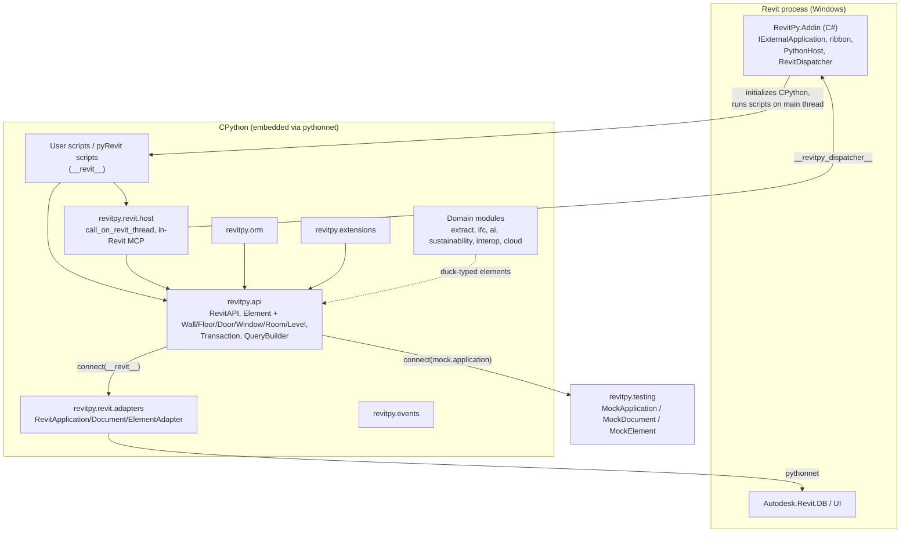
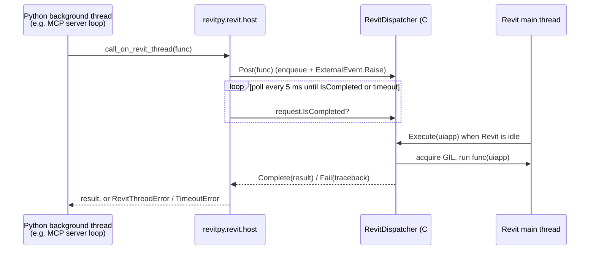

RevitPy is a CPython package (`revitpy/`) plus one C# Revit add-in (`src/RevitPy.Addin`) that hosts CPython inside Revit. The Python code is written against small protocols (`IRevitApplication`, `IRevitDocument`, `IRevitElement`). Two implementations of those protocols exist:

- **Live Revit**: `revitpy.revit.adapters` wraps `Autodesk.Revit.DB` objects through pythonnet.
- **Tests**: `revitpy.testing` provides `MockApplication`, `MockDocument` and `MockElement`.

Everything above that seam (queries, typed elements, transactions, the ORM) runs the same code in both cases.

## Layer Diagram



## Live Revit Connectivity

### Adapter layer (`revitpy/revit/adapters.py`)

`RevitAPI.connect(app)` checks whether `app` already looks like a RevitPy application (it has `ActiveDocument`). If it doesn't, `connect()` wraps it with `adapt_application()`. That means pyRevit's or the add-in's `__revit__` (a `UIApplication`) and a plain `Application` both work.

| Adapter | Wraps | Notes |
|---|---|---|
| `RevitApplicationAdapter` | `UIApplication` or `Application` | `ActiveDocument` (UI only), `OpenDocumentFile`, `CreateDocument` (`NewProjectDocument`), `GetOpenDocuments` |
| `RevitDocumentAdapter` | `DB.Document` | `FilteredElementCollector`-based `GetElements` / `GetElementsByCategory`. `GetElement`, `Delete`, `Save`, `Close`. `StartTransaction` opens a `Transaction`, or a `SubTransaction` when the document is already modifiable. |
| `RevitElementAdapter` | `DB.Element` | `GetParameterValue` converts by `StorageType` (String, Double, Integer, ElementId). It supports the pseudo-parameters `Name`, `Category`, `Type`, `Family` and `Level`. `SetParameterValue` converts to the storage type and raises `PermissionError` for read-only parameters. |

`Autodesk.Revit.DB` is loaded lazily by `load_revit_api()`, so the module imports on any platform. Using an adapter outside Revit raises `RevitApiUnavailableError`. Values are in Revit internal units (feet).

### Typed elements and transactions (`revitpy/api/`)

- `Element.wrap()` picks the subclass registered for the element's category. `Wall`, `Floor`, `Door`, `Window`, `Room` and `Level` declare `revit_categories` such as `("OST_Walls", "Walls")`. `RevitDocumentProvider.get_elements_of_type()` uses `GetElementsByCategory` when the document provides it, which makes `api.query(Wall)` work.
- `Transaction` delegates to `RevitDocumentProvider.start_transaction()`, which calls the document's `StartTransaction`. A document without one raises `TransactionError`. Commit and rollback call the handle's `Commit()` / `RollBack()`. An exception inside `with api.transaction(...)` rolls back.
- `Element.set_parameter_value()` writes through to the Revit element immediately. The change log (`is_dirty`, `changes`) is kept for inspection and `discard_changes()`.

### Host add-in (`src/RevitPy.Addin`)

| File | Responsibility |
|---|---|
| `RevitPyApplication.cs` | `IExternalApplication` (`RevitPy.Addin.RevitPyApplication`). Loads settings, registers the dispatcher, and builds the **RevitPy** ribbon tab (Run Script, Rerun, MCP Server, About). Optionally initializes Python at startup. |
| `AddinSettings.cs` | Reads `%APPDATA%\RevitPy\settings.ini` (`python_dll`, `python_home`, `python_path`\*, `startup_script`\*, `initialize_on_startup`). Env overrides: `REVITPY_PYTHON_DLL` / `_HOME` / `_PATH`. Finds a CPython 3.11–3.14 DLL. |
| `PythonHost.cs` | Initializes CPython via pythonnet on Revit's main thread and appends `python_path` entries to `sys.path`. Exposes the dispatcher as `builtins.__revitpy_dispatcher__`, then releases the GIL. Runs scripts as `__main__` with `__revit__` bound and stdout/stderr captured. |
| `RevitDispatcher.cs` | `IExternalEventHandler` queue that runs Python callables on Revit's main thread. |
| `Commands.cs` | The four ribbon commands. The MCP button runs `revitpy.revit.host.toggle_mcp_server(__revit__)`. |
| `RevitPy.addin` | Manifest, installed next to a `RevitPy\` folder that holds the DLLs. |

The project builds one Revit version at a time: `dotnet build -c Release -p:RevitVersion=2025`. The mapping is 2024 → net48, 2025/2026 → net8.0-windows, 2027 → net10.0-windows. Revit API reference assemblies come from the `Nice3point.Revit.Api.*` NuGet packages, so the build also works on Linux CI. `scripts/install-addin.ps1` builds and installs it.

> `src/RevitPy.Addin` is the only C# project; the earlier C# host design was removed in the 2026 refresh.

### Threading model

Revit's API is single-threaded. The add-in initializes CPython on Revit's main thread, so in Python `threading.main_thread()` is Revit's API thread. After initialization the add-in releases the GIL so that Python background threads can run while Revit is idle.



- Code already on the main thread (ribbon scripts, pyRevit scripts, event handlers) calls the API directly. `call_on_revit_thread` detects this and runs `func` inline.
- The caller **polls** instead of blocking. pythonnet holds the GIL during .NET calls, so a blocking wait would stop `Execute()` from getting the GIL and would deadlock Revit.
- `TimeoutError` (default 60 s) usually means a modal dialog is open or Revit is busy.
- `AsyncRevit`, `TaskQueue`, the async decorators and the ORM's `*_async` query methods run synchronous work in thread-pool executors. Don't use them for Revit API calls on a live model.

### In-Revit MCP server (`revitpy/revit/host.py`)

`start_mcp_server(uiapp)` builds a `RevitAPI` connected to the live session and wraps its tools in `MainThreadRevitTools`, which runs every tool through `call_on_revit_thread`. It then runs `McpServer` on a daemon thread with its own asyncio loop. Defaults come from `REVITPY_MCP_HOST` (`127.0.0.1`), `REVITPY_MCP_PORT` (`8765`) and `REVITPY_MCP_TOKEN` (random if unset). The server requires `Authorization: Bearer <token>`. The `SafetyGuard` uses `revit_confirmation`, a Yes/No `TaskDialog` shown on the main thread, to approve model-changing tools. Any failure or timeout denies the call.

## Directory Structure

```
revitpy/
  __init__.py        Public API (RevitAPI, Element, Transaction, FilterOperator,
                     EventManager, EventType, EventPriority, event_handler,
                     Extension, MockRevit, Config, feature-module classes)
  cli.py             `revitpy` command: version, doctor, mcp-serve
  config.py          Config, ConfigManager

  api/
    wrapper.py       RevitAPI, RevitDocumentProvider, DocumentInfo, protocols
    element.py       Element, Wall/Floor/Door/Window/Room/Level, ElementSet,
                     ElementId, ParameterValue, ElementProperty
    transaction.py   Transaction, TransactionGroup, TransactionOptions,
                     TransactionStatus, transaction_scope, retry_transaction
    query.py         QueryBuilder, Query, FilterOperator, SortDirection
    exceptions.py    RevitAPIError, TransactionError, ElementNotFoundError,
                     ValidationError, PermissionError, ModelError, ConnectionError

  revit/
    adapters.py      pythonnet adapters, adapt_application, load_revit_api
    host.py          call_on_revit_thread, in_revit_host, MCP server in Revit

  orm/               context.py, query_builder.py, element_set.py, cache.py,
                     change_tracker.py, relationships.py, async_support.py,
                     validation.py, decorators.py, types.py, exceptions.py
  events/            manager.py, dispatcher.py, handlers.py, decorators.py,
                     filters.py, types.py
  extensions/        extension.py, manager.py, loader.py, registry.py,
                     lifecycle.py, dependency_injection.py, decorators.py
  async_support/     async_revit.py, task_queue.py, context_managers.py,
                     decorators.py, cancellation.py, progress.py
  performance/       optimizer.py, benchmarks.py, memory.py, monitoring.py
  testing/           mock_revit.py (MockRevit, MockApplication, MockDocument,
                     MockElement, MockTransaction, MockParameter, MockElementId)

  extract/           quantities.py (QuantityExtractor), materials.py (MaterialTakeoff),
                     costs.py (CostEstimator), schedules.py (ScheduleBuilder),
                     exporters.py (DataExporter), types.py, exceptions.py
  ifc/               exporter.py (IfcExporter), importer.py (IfcImporter),
                     mapper.py (IfcElementMapper), validator.py (IdsValidator),
                     bcf.py (BcfManager), diff.py (IfcDiff), types.py, _compat.py
  ai/                server.py (McpServer), tools.py (RevitTools), safety.py
                     (SafetyGuard), prompts.py (PromptLibrary), _protocol.py, types.py
  sustainability/    carbon.py (CarbonCalculator), epd.py (EpdDatabase),
                     compliance.py (ComplianceChecker), materials.py
                     (MaterialExtractor), reports.py (SustainabilityReporter),
                     matching.py, types.py
  interop/           client.py (SpeckleClient), sync.py (SpeckleSync), mapper.py
                     (SpeckleTypeMapper), diff.py, merge.py, subscriptions.py,
                     types.py, _compat.py
  cloud/             auth.py (ApsAuthenticator), client.py (ApsClient), jobs.py
                     (JobManager), batch.py (BatchProcessor), ci.py (CIHelper),
                     webhooks.py (WebhookHandler), types.py

src/RevitPy.Addin/   C# host add-in (the only C# project that is built)
scripts/install-addin.ps1
```

## Module Responsibilities

### Core API (`revitpy/api/`)

- **`RevitAPI`**: connection lifecycle (`connect` / `disconnect`), document operations, and the factory for queries (`query()`, `elements`) and transactions (`transaction()`, `transaction_group()`). It must be connected first. Otherwise these raise `ConnectionError`.
- **`Element`** and its typed subclasses: parameter access with caching and conversion, and immediate write-through with a change log.
- **`ElementSet`**: LINQ-style collection (`where`, `select`, `first`, `single`, `any`, `all`, `order_by`, `group_by`).
- **`Transaction` / `TransactionGroup`**: context managers over the provider's transactions, with commit and rollback handlers. `retry_transaction()` retries a whole operation.
- **`QueryBuilder`**: property/`FilterOperator` filters, sorting, `skip` / `take`, `distinct`.

### ORM (`revitpy/orm/`)

`RevitContext` (created with `create_context(provider)`) combines the ORM `QueryBuilder`, `CacheManager`, `ChangeTracker` and `RelationshipManager`. `save_changes()` / `save_changes_async()` pass tracked changes to an optional `IUnitOfWork` and commit it, raising on failure. Without a unit of work, changes are only accepted in the tracker. Any `IElementProvider` works as the data source, including `api.active_document`.

### Events, Extensions, Async, Performance, Testing, Config

- **Events**: singleton `EventManager` with priority-based `EventDispatcher`. Register handlers with `register_function()` or the `@event_handler([...])` decorator on module-level functions.
- **Extensions**: `Extension` base class (constructed with `ExtensionMetadata`), `ExtensionManager`, DI container.
- **Async**: `AsyncRevit`, `TaskQueue`, cancellation and progress. These use executors (see [Threading model](#threading-model)).
- **Performance**: `PerformanceOptimizer`, `AdaptiveCache`, `ObjectPool`, `BenchmarkSuite` / `BenchmarkRunner`, `MemoryManager` / `MemoryLeakDetector`, `MetricsCollector` / `PerformanceMonitor` / `AlertingSystem`. It imports `psutil`, which is installed with the `dev` extra.
- **Testing**: `MockRevit` and the mock application, document and element classes. `MockDocument.StartTransaction` supports commit, rollback and nesting through snapshot and restore.
- **Config**: `Config` (dict-backed) and `ConfigManager` (YAML).

### Domain modules

`extract`, `ifc`, `ai`, `sustainability`, `interop` and `cloud` operate on duck-typed element objects and plain dataclasses. None of them requires a live Revit session. See the [feature guides]({{ '/user/' | relative_url }}) for each one. IFC needs the `ifc` extra (`ifcopenshell>=0.8`, `ifctester`, `defusedxml`), and Speckle needs the `interop` extra (`specklepy>=3`).

### CLI (`revitpy/cli.py`)

`revitpy version`, `revitpy doctor [--json]` (environment and optional-integration checks, exit 1 if a core dependency is missing) and `revitpy mcp-serve [--host --port --token]` (MCP server without a live Revit connection).

## Dependency Graph

Arrows point from dependent to dependency (package-internal imports only).

```
revitpy/api/          ---> revitpy/revit/  (lazy, in RevitAPI.connect)
revitpy/revit/        ---> revitpy/api/, revitpy/ai/
revitpy/orm/          ---> revitpy/api/
revitpy/extract/      ---> revitpy/api/
revitpy/async_support/---> revitpy/api/
revitpy/events/       ---> revitpy/async_support/
revitpy/extensions/   ---> revitpy/api/, async_support/, events/, config
revitpy/cli.py        ---> revitpy/ai/, revitpy/revit/
revitpy/testing/, performance/, ifc/, ai/, sustainability/, interop/, cloud/
                      ---> (no internal dependencies)
```

## Third-Party Dependencies

Runtime dependencies from `pyproject.toml`:

| Package | Constraint | Purpose |
|---|---|---|
| pydantic | >= 2.5, < 3 | Validation (`ParameterValue`, ORM models) |
| typing-extensions | >= 4.0.0 | Backported type hints |
| aiofiles | >= 23.0.0 | Async file I/O |
| loguru | >= 0.7.0 | Logging |
| httpx | >= 0.25.0 | HTTP (APS cloud client, EC3 EPD lookups) |
| websockets | >= 11.0.0 | MCP server (`<12` when specklepy is installed, via gql) |
| pyyaml | >= 6.0.0 | YAML configuration |
| click | >= 8.0.0 | `revitpy` CLI |
| rich | >= 13.0.0 | CLI output |
| jinja2 | >= 3.0.0 | Prompt templates |

pythonnet is not a pip dependency. The add-in (or pyRevit) provides it inside Revit.
