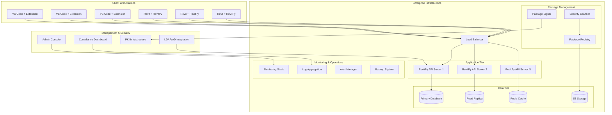
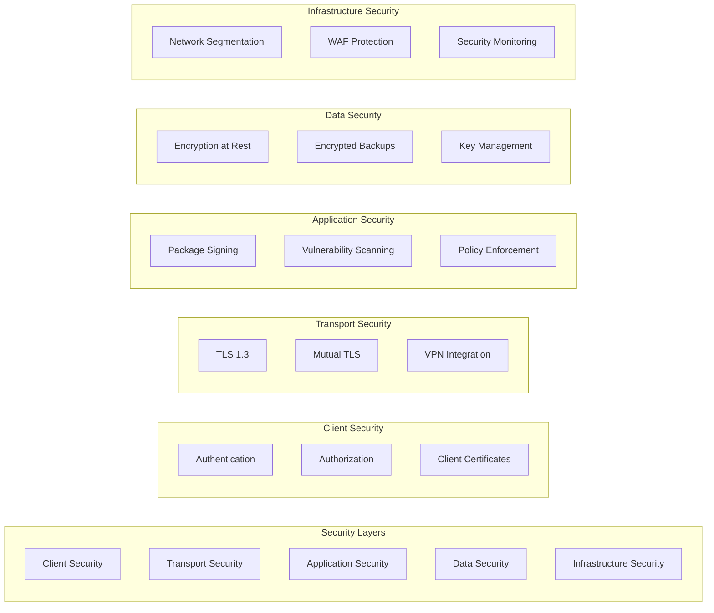

# Enterprise Documentation

RevitPy is designed from the ground up for enterprise deployment with enterprise-grade security, scalability, and administration features. This section provides comprehensive guidance for deploying and managing RevitPy at scale.

## 🏢 Enterprise Overview

RevitPy Enterprise provides the tools and infrastructure needed to deploy Revit automation across large organizations with:

- **Centralized Management**: Single pane of glass for managing RevitPy deployments
- **Enterprise Security**: Role-based access control, package signing, and vulnerability scanning
- **Scalable Infrastructure**: High-availability deployments with auto-scaling capabilities
- **Compliance Ready**: Audit trails, compliance reporting, and policy enforcement
- **Professional Support**: 24/7 support, SLA guarantees, and dedicated customer success

## 🚀 Quick Start for Enterprises

### 30-Minute Enterprise Deployment

Get RevitPy running in your enterprise environment quickly:

<div class="grid cards" markdown>

-   :material-numeric-1-box:{ .lg .middle } __Infrastructure Planning__

    ---

    **Time:** 10 minutes

    Plan your deployment architecture and resource requirements.

    [:octicons-arrow-right-24: Deployment Planning](deployment.md#planning)

-   :material-numeric-2-box:{ .lg .middle } __Security Configuration__

    ---

    **Time:** 10 minutes

    Configure enterprise security policies and access controls.

    [:octicons-arrow-right-24: Security Setup](security.md#quick-setup)

-   :material-numeric-3-box:{ .lg .middle } __Mass Deployment__

    ---

    **Time:** 10 minutes

    Deploy to workstations using Group Policy or SCCM.

    [:octicons-arrow-right-24: Mass Deployment](deployment.md#group-policy)

</div>

## 📊 Enterprise Architecture

RevitPy Enterprise consists of several integrated components:



### Core Components

| Component | Purpose | Scalability | HA Support |
|-----------|---------|-------------|------------|
| **API Servers** | Core RevitPy services | Auto-scaling | ✅ Active-Active |
| **Package Registry** | Secure package distribution | CDN integration | ✅ Multi-region |
| **Database Cluster** | Persistent data storage | Read replicas | ✅ Master-Slave |
| **Cache Layer** | Performance optimization | Cluster mode | ✅ Redis Sentinel |
| **Object Storage** | Package and asset storage | Multi-region | ✅ Cross-region replication |
| **Monitoring Stack** | Observability and alerting | Federated | ✅ Multi-datacenter |

## 🔒 Security Features

### Multi-Layered Security Architecture

RevitPy Enterprise implements defense-in-depth security:



### Key Security Features

- **🔐 Zero Trust Architecture**: Every request verified and authorized
- **🛡️ Package Signing**: Cryptographic verification of all packages
- **🔍 Vulnerability Scanning**: Automated security assessment of dependencies
- **👥 RBAC**: Role-based access control with LDAP/AD integration
- **📋 Audit Logging**: Comprehensive audit trails for compliance
- **🔒 Data Encryption**: End-to-end encryption of all data
- **🚨 Threat Detection**: Real-time security monitoring and alerting

## 📈 Scalability and Performance

### Performance Benchmarks

RevitPy Enterprise is tested at scale:

| Metric | Small Org (50 users) | Medium Org (500 users) | Large Org (5000+ users) |
|--------|---------------------|----------------------|------------------------|
| **Concurrent Users** | 50 | 500 | 5,000+ |
| **API Response Time** | <100ms | <200ms | <300ms |
| **Package Downloads** | 1,000/day | 10,000/day | 100,000/day |
| **Storage Requirements** | 100GB | 1TB | 10TB+ |
| **Database Load** | Light | Moderate | Heavy |
| **Infrastructure Cost** | $500/month | $2,500/month | $15,000/month |

### Scaling Strategies

#### Horizontal Scaling
```yaml
# Kubernetes deployment example
apiVersion: apps/v1
kind: Deployment
metadata:
  name: revitpy-api
spec:
  replicas: 3  # Scale based on demand
  selector:
    matchLabels:
      app: revitpy-api
  template:
    metadata:
      labels:
        app: revitpy-api
    spec:
      containers:
      - name: revitpy-api
        image: revitpy/api:latest
        resources:
          requests:
            memory: "256Mi"
            cpu: "250m"
          limits:
            memory: "512Mi"
            cpu: "500m"
        env:
        - name: DATABASE_URL
          valueFrom:
            secretKeyRef:
              name: revitpy-secrets
              key: database-url
---
apiVersion: v1
kind: Service
metadata:
  name: revitpy-api-service
spec:
  selector:
    app: revitpy-api
  ports:
  - port: 80
    targetPort: 8000
  type: LoadBalancer
```

#### Vertical Scaling
```yaml
# Resource optimization for large deployments
resources:
  api_servers:
    cpu: "2000m"
    memory: "4Gi"
    replicas: 5

  database:
    cpu: "4000m"
    memory: "16Gi"
    storage: "1Ti"

  cache:
    cpu: "1000m"
    memory: "8Gi"
    replicas: 3
```

## 📋 Compliance and Governance

### Regulatory Compliance

RevitPy Enterprise supports compliance with major regulations:

- **SOC 2 Type II**: Annual security and availability audits
- **ISO 27001**: Information security management certification
- **GDPR**: Data protection and privacy compliance
- **HIPAA**: Healthcare information protection (with BAA)
- **FedRAMP**: Federal government cloud security (in progress)

### Audit and Reporting

```python
# Example audit query
from revitpy.enterprise import AuditService

audit = AuditService()

# Generate compliance report
report = audit.generate_report(
    start_date="2024-01-01",
    end_date="2024-12-31",
    report_type="SOC2",
    include_sections=[
        "access_controls",
        "data_protection",
        "availability",
        "confidentiality"
    ]
)

# Export for compliance team
report.export("compliance_report_2024.pdf")
```

### Policy Management

```yaml
# Enterprise policy configuration
policies:
  package_management:
    require_signing: true
    vulnerability_threshold: "medium"
    auto_update: false
    approval_required: true

  access_control:
    mfa_required: true
    session_timeout: 28800  # 8 hours
    ip_whitelist_enabled: true

  data_governance:
    encryption_required: true
    backup_retention: 2555  # 7 years
    audit_log_retention: 2555
```

## 🎯 Enterprise Use Cases

### Large Architecture Firm

**Challenge**: 500-person firm with global offices needs standardized Revit automation
**Solution**:
- Centralized package registry with regional CDN
- LDAP integration for single sign-on
- Automated deployment via Group Policy
- Performance monitoring and optimization

**Results**:
- 60% reduction in IT support tickets
- 40% faster script deployment cycles
- 99.9% uptime across all offices
- Standardized development practices

### Engineering Consultancy

**Challenge**: 200-person consultancy with strict security requirements
**Solution**:
- Air-gapped private registry deployment
- Enhanced security scanning and signing
- Custom approval workflows
- Comprehensive audit logging

**Results**:
- Passed SOC 2 Type II audit
- Zero security incidents in 18 months
- 50% reduction in compliance preparation time
- Improved client confidence and new contracts

### Government Agency

**Challenge**: Federal agency needs FedRAMP-compliant Revit automation
**Solution**:
- FedRAMP-ready cloud deployment
- Enhanced security controls and monitoring
- Complete audit trail and reporting
- Multi-factor authentication integration

**Results**:
- FedRAMP Authority to Operate (ATO) achieved
- 30% improvement in project delivery times
- Enhanced security posture
- Reduced manual processes by 70%

## 📚 Enterprise Documentation Sections

### For IT Administrators
- **[Deployment Guide](deployment.md)**: Complete deployment procedures and best practices
- **[Security Configuration](security.md)**: Security hardening and compliance setup
- **[Administration Guide](administration.md)**: Day-to-day operational procedures
- **[Monitoring & Observability](monitoring.md)**: Performance monitoring and alerting
- **[Backup & Recovery](backup-recovery.md)**: Data protection and disaster recovery

### For Security Teams
- **[Security Architecture](security.md#architecture)**: Comprehensive security design
- **[Threat Model](security.md#threat-model)**: Security risk assessment and mitigation
- **[Compliance Guide](compliance.md)**: Regulatory compliance procedures
- **[Incident Response](security.md#incident-response)**: Security incident handling
- **[Penetration Testing](security.md#pen-testing)**: Security testing procedures

### for Development Teams
- **[Enterprise Development](../guides/enterprise-development.md)**: Development in enterprise environments
- **[Package Development](../tutorials/package-development.md)**: Creating enterprise-ready packages
- **[Testing Strategies](../guides/testing-strategies.md)**: Enterprise testing approaches
- **[CI/CD Integration](../guides/cicd-integration.md)**: Continuous integration and deployment

## 🎓 Enterprise Training and Certification

### Administrator Certification Program

**RevitPy Certified Administrator** - 16-hour certification program covering:

- **Module 1**: Enterprise Architecture (4 hours)
- **Module 2**: Security and Compliance (4 hours)
- **Module 3**: Deployment and Configuration (4 hours)
- **Module 4**: Operations and Troubleshooting (4 hours)

**Certification Benefits**:
- Official RevitPy Administrator credential
- Access to private administrator community
- Priority support and direct engineering access
- Quarterly admin-only webinars and training

### Team Training Programs

**Executive Overview** (2 hours)
- Strategic benefits of RevitPy Enterprise
- ROI analysis and business case development
- Implementation planning and timeline
- Risk management and mitigation

**Technical Deep Dive** (2 days)
- Hands-on deployment workshop
- Security configuration lab
- Performance tuning exercises
- Troubleshooting scenarios

**End User Training** (4 hours)
- RevitPy development basics
- Package management and deployment
- Security best practices
- Productivity tips and tricks

## 💼 Enterprise Support and Services

### Support Tiers

| Feature | Community | Professional | Enterprise |
|---------|-----------|-------------|------------|
| **Response Time** | Best effort | 4 business hours | 1 hour |
| **Support Channels** | Forum, Discord | Email, Phone | Dedicated Slack |
| **Severity Levels** | General | 3 levels | 4 levels |
| **SLA Guarantee** | None | 99% | 99.9% |
| **Technical Account Manager** | ❌ | ❌ | ✅ |
| **Custom Development** | ❌ | Limited | ✅ |
| **Training Credits** | ❌ | 2 sessions | 10 sessions |
| **Price** | Free | $50/user/month | Custom |

### Professional Services

**Implementation Services**
- Enterprise architecture design
- Custom deployment automation
- Security hardening and compliance
- Integration with existing systems

**Migration Services**
- PyRevit to RevitPy migration
- Legacy system modernization
- Data migration and validation
- Change management support

**Custom Development**
- Enterprise-specific features
- Custom integrations and connectors
- Specialized security requirements
- Performance optimization

## 📞 Getting Started with Enterprise

### Evaluation Process

1. **Technical Evaluation** (2 weeks)
   - Deploy in test environment
   - Run pilot with small team
   - Evaluate against requirements
   - Performance and security testing

2. **Business Evaluation** (1 week)
   - ROI analysis and cost modeling
   - Stakeholder presentations
   - Procurement process initiation
   - Contract negotiation

3. **Pilot Deployment** (4 weeks)
   - Production-like environment
   - Larger user group (50-100 users)
   - Integration with existing systems
   - Performance validation

### Contact Enterprise Sales

Ready to transform your organization with RevitPy Enterprise?

- **📧 Email**: [enterprise@revitpy.dev](mailto:enterprise@revitpy.dev)
- **📞 Phone**: +1 (555) 123-REVIT
- **💼 Request Demo**: [revitpy.dev/demo](https://revitpy.dev/demo)
- **📋 Enterprise Trial**: [revitpy.dev/enterprise-trial](https://revitpy.dev/enterprise-trial)

### Enterprise Resources

- **🎥 Executive Demo**: [Watch 15-minute overview](https://vimeo.com/revitpy/enterprise-demo)
- **📊 ROI Calculator**: [Calculate potential savings](https://revitpy.dev/roi-calculator)
- **📋 RFP Template**: [Download RFP template](https://revitpy.dev/rfp-template)
- **🔒 Security Whitepaper**: [Download security overview](https://revitpy.dev/security-whitepaper)

---

RevitPy Enterprise provides the foundation for modern, scalable Revit automation in enterprise environments. With enterprise-grade security, comprehensive compliance support, and professional services, RevitPy Enterprise enables organizations to standardize and scale their Revit automation initiatives while maintaining the highest standards of security and reliability.

Ready to get started? [Contact our enterprise team](mailto:enterprise@revitpy.dev) for a personalized demonstration and deployment planning session.

---

!!! tip "Enterprise Quick Links"

    - 🚀 [30-Minute Quick Start](deployment.md#quick-start)
    - 🔒 [Security Configuration](security.md)
    - 📊 [Monitoring Setup](monitoring.md)
    - 📋 [Compliance Guide](compliance.md)
    - 💼 [Professional Services](mailto:enterprise@revitpy.dev)

    **Need help?** Contact our enterprise team at [enterprise@revitpy.dev](mailto:enterprise@revitpy.dev)
