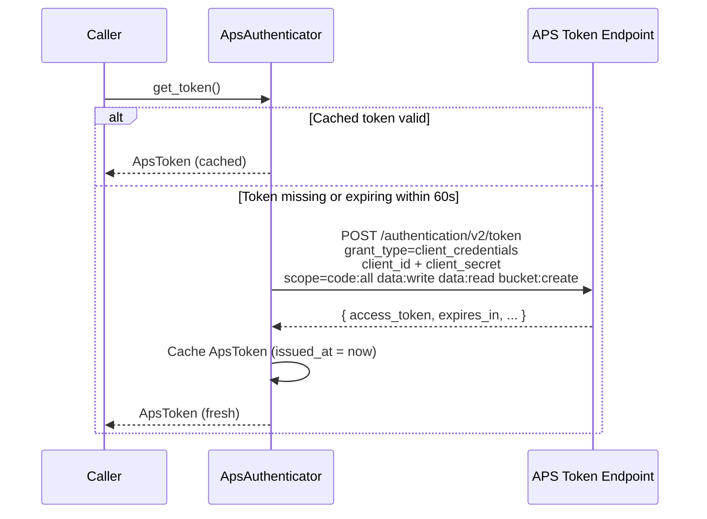
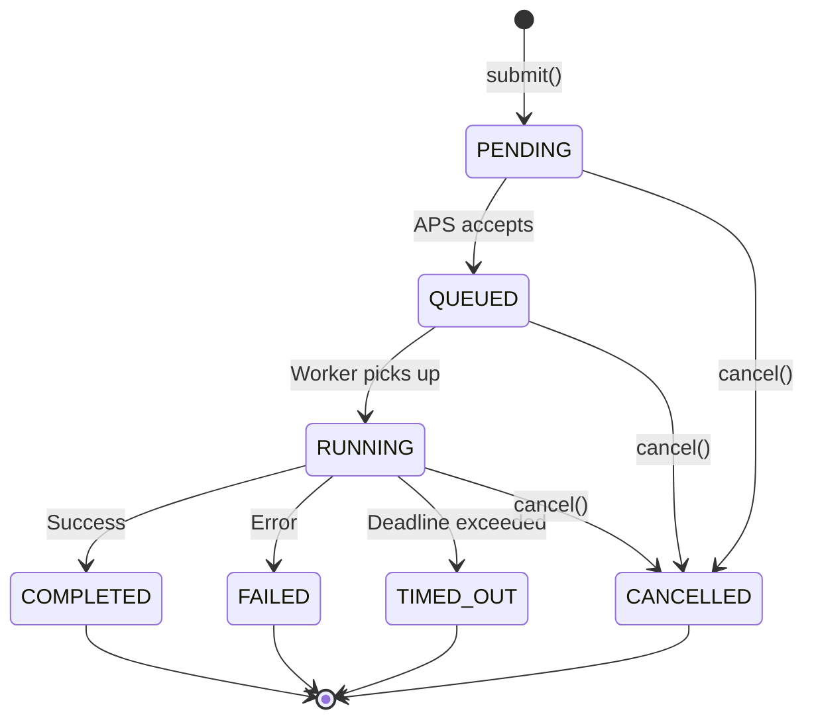
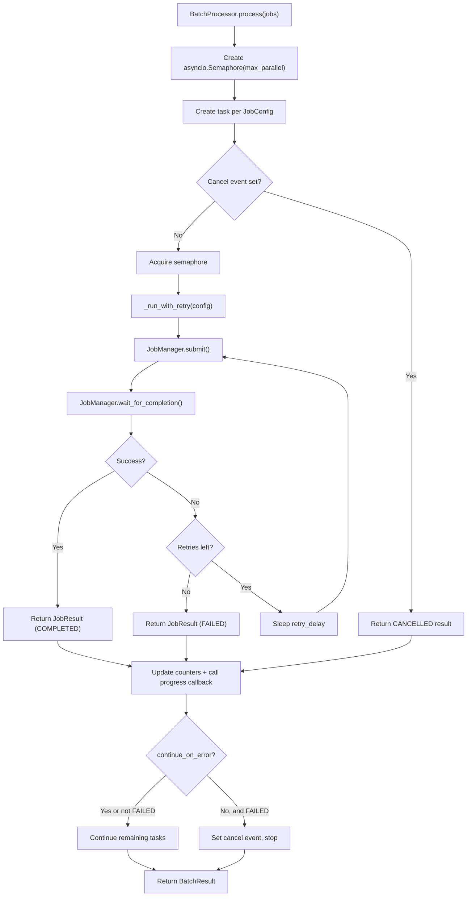

# Infrastructure & Cloud

This document describes RevitPy's cloud integration layer: authentication against Autodesk Platform Services (APS), the Design Automation job pipeline, batch processing, CI/CD generation, webhook handling, and the rate limiting and retry strategies that tie them together.

## APS Integration Architecture

The `revitpy.cloud` package provides an async-first client stack for interacting with the Autodesk Platform Services (formerly Forge) APIs. The stack is layered with clear separation of concerns:

```
revitpy.cloud
  auth.py          ApsAuthenticator     OAuth2 client-credentials flow
  client.py        ApsClient            Authenticated HTTP with rate limiting + retry
  jobs.py          JobManager           Design Automation work-item lifecycle
  batch.py         BatchProcessor       Parallel job orchestration
  ci.py            CIHelper             GitHub Actions / GitLab CI generation
  webhooks.py      WebhookHandler       HMAC verification + event routing
  types.py         dataclasses/enums    Shared type definitions
  exceptions.py    CloudError hierarchy Structured error types
```

All HTTP communication uses `httpx.AsyncClient`. The entire cloud layer is fully asynchronous, designed to run inside an `asyncio` event loop.

### Region Support

`ApsClient` accepts a `CloudRegion` enum (`US` or `EMEA`) at construction time, allowing requests to be routed to the appropriate APS regional endpoint.

## OAuth2 Authentication Flow

RevitPy authenticates with APS using the **OAuth2 client-credentials grant**, which is the standard flow for server-to-server automation where no interactive user is involved.

### Token Lifecycle

`ApsAuthenticator` manages the full token lifecycle:

1. **Initial authentication** -- `authenticate()` sends a `POST` to the APS token endpoint with `grant_type=client_credentials`, the application's `client_id` and `client_secret`, and the requested scopes.
2. **Token caching** -- the issued `ApsToken` is stored in memory. Subsequent calls to `get_token()` return the cached token without a network round trip.
3. **Automatic refresh** -- `get_token()` checks `is_token_valid()` before returning. When the token is within 60 seconds of expiry, a fresh `authenticate()` call is triggered transparently.
4. **Error mapping** -- HTTP errors from the token endpoint are caught and re-raised as `AuthenticationError` with the original exception preserved as `cause`.



### Credentials and Scopes

`ApsCredentials` is a simple dataclass holding `client_id`, `client_secret`, and an optional `region` (defaults to `CloudRegion.US`). The requested scope is fixed at:

```
code:all data:write data:read bucket:create
```

This provides the permissions required for Design Automation operations: submitting work items, uploading/downloading files via OSS buckets, and reading results.

### Token Structure

`ApsToken` records the `access_token`, `token_type` (default `Bearer`), `expires_in` (default 3600 seconds), `scope`, and the `issued_at` timestamp. The `is_expired` property applies the 60-second buffer:

```python
@property
def is_expired(self) -> bool:
    return time.time() >= (self.issued_at + self.expires_in - 60)
```

## Design Automation Job Pipeline

The `JobManager` class wraps the APS Design Automation v3 WorkItems API (`/da/us-east/v3/workitems`), providing a high-level interface for the full job lifecycle.

### Job Lifecycle State Machine

A Design Automation work item moves through the following states:



These states are represented by the `JobStatus` enum:

| Value | Description |
|---|---|
| `PENDING` | Submitted, not yet acknowledged by the queue |
| `QUEUED` | Accepted and waiting for a worker |
| `RUNNING` | Actively executing on a cloud worker |
| `COMPLETED` | Finished successfully |
| `FAILED` | Terminated with an error |
| `CANCELLED` | Cancelled by the caller |
| `TIMED_OUT` | Exceeded the configured timeout |

### Submit

`JobManager.submit(config: JobConfig) -> str` constructs a work-item payload from a `JobConfig` and sends it to the APS API. The payload includes:

- `activityId` -- the Design Automation activity to execute (e.g. `RevitPy.Validate+prod`).
- `arguments.inputFile` -- URL of the input Revit file (verb: `get`).
- `arguments.outputFile` -- optional output location (verb: `put`).
- `arguments.scriptPath` -- optional URL of the processing script (verb: `get`).
- `arguments.parameters` -- optional key-value parameters.

On success the method returns the `job_id` string. On failure it raises `JobSubmissionError`.

### Poll and Wait

`JobManager.wait_for_completion(job_id, timeout=600.0, poll_interval=5.0) -> JobResult` polls `GET /da/us-east/v3/workitems/{job_id}` at the specified interval until the job reaches a terminal state (`COMPLETED`, `FAILED`, `CANCELLED`, or `TIMED_OUT`).

- If the job completes successfully, a `JobResult` is returned with `output_files`, `logs` (report URL), and `duration_ms`.
- If the job fails, a `JobExecutionError` is raised.
- If the timeout is exceeded before the job finishes, a `JobExecutionError` is raised with status `timed_out`.

### Download Results

`JobManager.download_results(job_id, output_dir: Path) -> list[Path]` fetches the output file URLs from the work-item response and downloads each one to the specified local directory using a raw `httpx.AsyncClient` (outside the authenticated client, since output URLs are pre-signed).

### Cancel and Logs

- `cancel(job_id) -> bool` sends a `DELETE` request to cancel a running or queued job.
- `get_logs(job_id) -> str` retrieves the `reportUrl` from the work-item response and downloads the execution log as plain text.

## Batch Processing Architecture

`BatchProcessor` orchestrates the parallel execution of multiple Design Automation jobs with retry logic, progress reporting, and cancellation support.

### Configuration

`BatchConfig` controls batch behaviour:

| Field | Default | Description |
|---|---|---|
| `max_parallel` | 5 | Maximum concurrent jobs (enforced by `asyncio.Semaphore`) |
| `retry_count` | 2 | Number of retry attempts per failed job |
| `retry_delay` | 30.0 | Seconds to wait between retries |
| `continue_on_error` | `True` | Whether to continue processing after a job fails |

### Processing Pipeline



### Key Behaviours

- **Bounded concurrency** -- `asyncio.Semaphore(max_parallel)` ensures no more than `max_parallel` jobs are in flight simultaneously. Tasks are created eagerly with `asyncio.create_task`, but each awaits the semaphore before submitting to APS.
- **Per-job retry** -- `_run_with_retry` catches `JobExecutionError` and retries up to `retry_count` times with a fixed `retry_delay` between attempts. Unexpected exceptions break the retry loop immediately.
- **Progress callback** -- the optional `progress(completed, total)` callable is invoked after each job finishes, regardless of outcome.
- **Cancellation** -- an optional `asyncio.Event` can be passed. When set, pending tasks return immediately with a `CANCELLED` status. If `continue_on_error` is `False`, the first failure sets the cancel event automatically.
- **Directory scanning** -- `process_directory(input_dir, script_path)` is a convenience method that discovers all `.rvt` files in a directory, creates a `JobConfig` per file, and calls `process()`.

### Aggregate Results

`BatchResult` summarises the batch:

| Field | Description |
|---|---|
| `total_jobs` | Number of jobs submitted |
| `completed` | Count of jobs that succeeded |
| `failed` | Count of jobs that failed after all retries |
| `cancelled` | Count of jobs that were cancelled |
| `results` | List of per-job `JobResult` objects |
| `total_duration_ms` | Wall-clock duration of the entire batch |

## CI/CD Integration

`CIHelper` generates pipeline configuration files for automating Revit model validation in CI environments. It currently supports GitHub Actions and GitLab CI.

### GitHub Actions Workflow Generation

`CIHelper.generate_github_workflow()` produces a complete GitHub Actions YAML string. Parameters and their defaults:

| Parameter | Default | Description |
|---|---|---|
| `name` | `revitpy-validation` | Workflow name |
| `script_path` | `validate.py` | Path to the validation script |
| `revit_version` | `2024` | Target Revit version |
| `branches` | `main` | Comma-separated branch triggers |
| `runner` | `ubuntu-latest` | GitHub Actions runner label |
| `python_version` | `3.11` | Python version |

The generated workflow:

1. Triggers on push and pull request to the configured branches.
2. Checks out the repository.
3. Sets up Python with the specified version.
4. Installs `revitpy[cloud]`.
5. Runs the validation script with `APS_CLIENT_ID` and `APS_CLIENT_SECRET` injected from repository secrets.

### GitLab CI Pipeline Generation

`CIHelper.generate_gitlab_ci()` produces a GitLab CI YAML string using a `python:{version}-slim` Docker image. It triggers on merge request events and commits to the default branch.

### Saving Configurations

`CIHelper.save_workflow(content, output_path)` writes the generated YAML to disk, creating parent directories as needed.

### Example Usage

```python
from revitpy.cloud.ci import CIHelper

ci = CIHelper()

# Generate and save a GitHub Actions workflow
gh_yaml = ci.generate_github_workflow(
    name="model-validation",
    script_path="scripts/validate.py",
    revit_version="2025",
    branches="main, develop",
)
ci.save_workflow(gh_yaml, ".github/workflows/validate.yml")

# Generate and save a GitLab CI pipeline
gl_yaml = ci.generate_gitlab_ci(
    name="model-validation",
    script_path="scripts/validate.py",
    revit_version="2025",
)
ci.save_workflow(gl_yaml, ".gitlab-ci.yml")
```

## Webhook Handling

`WebhookHandler` receives, verifies, and routes incoming APS Design Automation webhook events.

### HMAC Signature Verification

When a `WebhookConfig` is supplied with a `secret`, `verify_signature(payload, signature)` computes an HMAC-SHA256 digest of the raw request body and compares it against the hex-encoded signature from the request header using `hmac.compare_digest` (constant-time comparison to prevent timing attacks).

```python
def verify_signature(self, payload: bytes, signature: str) -> bool:
    expected = hmac.new(
        self._config.secret.encode("utf-8"),
        payload,
        hashlib.sha256,
    ).hexdigest()
    return hmac.compare_digest(expected, signature)
```

If no secret is configured, calling `verify_signature` raises `WebhookError` to prevent accidental unverified processing.

### Event Routing

`handle_event(event_data: dict) -> WebhookEvent` parses the incoming JSON payload, extracts `eventType`, `jobId`, `status`, and `timestamp`, maps the raw status to a `JobStatus` enum member, and dispatches the event to registered callbacks.

### Callback Registration

`register_callback(event_type, callback)` registers a callable for a specific event type. When an event arrives:

1. All callbacks registered for that event type are invoked.
2. All callbacks registered for the wildcard `"*"` event type are also invoked.
3. Exceptions in individual callbacks are logged but do not prevent other callbacks from executing.

### WebhookEvent Structure

| Field | Type | Description |
|---|---|---|
| `event_type` | `str` | The APS event type string |
| `job_id` | `str` | The associated work-item identifier |
| `status` | `JobStatus` | Parsed status enum |
| `timestamp` | `str` | Event timestamp from APS |
| `payload` | `dict` | Full original JSON payload |

## Rate Limiting and Retry Strategy

### Sliding-Window Rate Limiter

`ApsClient` enforces a rate limit of 20 requests per second using a sliding-window algorithm. A `deque` records the `time.monotonic()` timestamp of each request. Before each request:

1. Timestamps older than 1 second are evicted from the front of the deque.
2. If the deque contains 20 or more entries, the client sleeps until the oldest entry is more than 1 second old.
3. The current timestamp is appended.

This produces smooth request pacing rather than bursty behaviour at window boundaries.

### Exponential Backoff Retry

`ApsClient.request()` retries on transient failures with exponential backoff:

| Property | Value |
|---|---|
| Retryable status codes | `429`, `500`, `502`, `503` |
| Maximum retries | 3 |
| Initial backoff | 1.0 second |
| Backoff formula | `1.0 * 2^attempt` (1s, 2s, 4s) |

For retryable HTTP status codes, the client logs a warning and sleeps before the next attempt. For non-retryable HTTP errors, the request fails immediately with `ApsApiError`. For network-level errors (`httpx.HTTPError`), the same backoff-and-retry logic applies.

If all retries are exhausted, an `ApsApiError` is raised with the original exception as `cause`.

## Cloud Exception Hierarchy

All cloud exceptions inherit from `CloudError`:

```
CloudError
  |
  +-- AuthenticationError       (auth_method)
  +-- JobSubmissionError        (job_config)
  +-- JobExecutionError         (job_id, status)
  +-- ApsApiError               (endpoint, status_code, response_body)
  +-- WebhookError              (event_type)
```

Each exception carries context-specific fields and preserves the original exception as `cause` for full traceability. This follows the same error propagation pattern used throughout the rest of the framework (catch at boundary, wrap and re-raise, log before raising).
