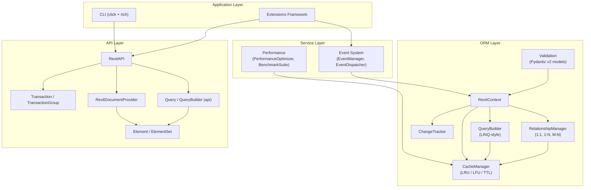
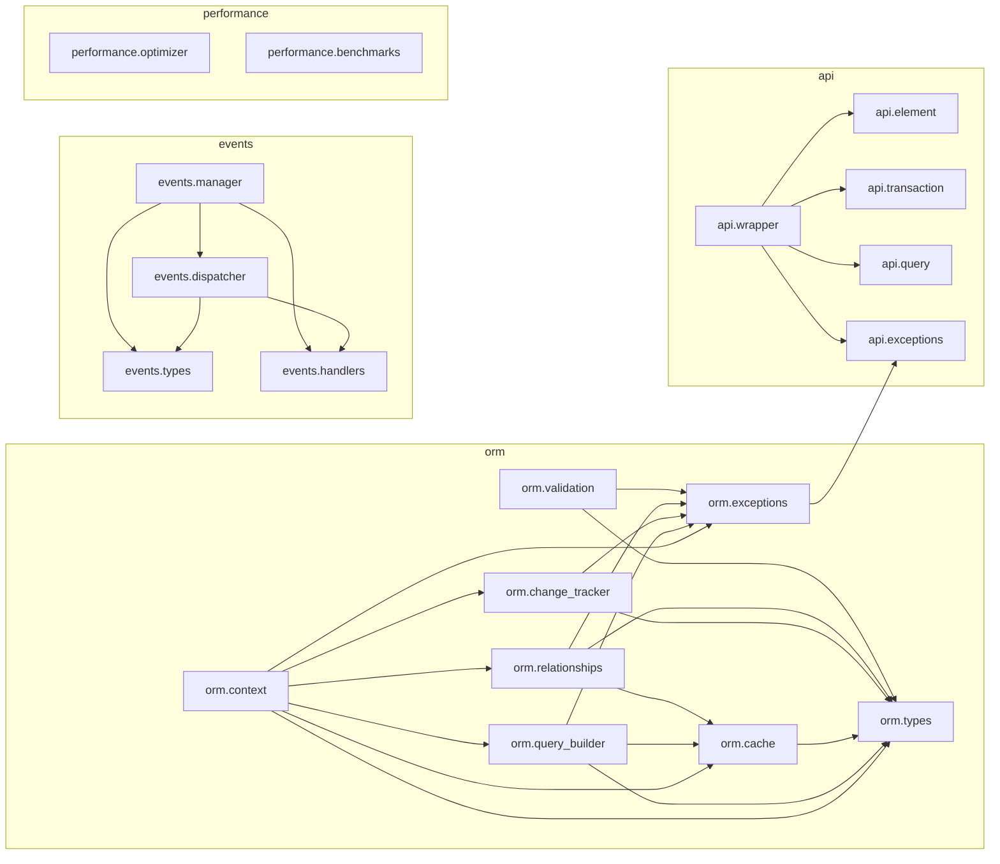

# System Design

This document describes RevitPy's component architecture, the design patterns each subsystem employs, the module dependency graph, the technology stack, and the key tradeoffs visible in the codebase.

## Component Architecture

The framework is organised into four primary layers. Each layer depends only on the layers below it (or on shared type definitions).

## Design Patterns

### ORM / Repository Pattern -- `revitpy.orm`

`RevitContext` (defined in `revitpy/orm/context.py`) acts as the Unit of Work and repository entry point. It orchestrates:

- **QueryBuilder** (`query_builder.py`) -- fluent, LINQ-style query construction with lazy evaluation. Each chained method (`where`, `select`, `order_by`, `skip`, `take`, `distinct`) returns a new `QueryBuilder` clone so query objects are immutable.
- **CacheManager** (`cache.py`) -- multi-level caching with configurable eviction policies.
- **ChangeTracker** (`change_tracker.py`) -- dirty checking with per-entity state snapshots.
- **RelationshipManager** (`relationships.py`) -- one-to-one, one-to-many, and many-to-many relationships with lazy/eager/select/batch load strategies.

The `IElementProvider` protocol (in `orm/types.py`) decouples the ORM from any specific data source, allowing the Revit document provider, mock providers for tests, or other backends to be swapped in.

### Builder Pattern -- `QueryBuilder`

`QueryBuilder` implements a fluent builder. Every intermediate method clones the builder and appends an operation to a `QueryPlan`. Terminal methods (`to_list`, `first`, `count`, `to_dict`, `group_by`) trigger execution through `LazyQueryExecutor`, which:

1. Optimises the plan (moves filters before projections, estimates cost).
2. Decides whether to enable parallel execution (when `estimated_cost > 10.0`).
3. Executes the operation pipeline as a lazy generator chain.
4. Caches results when the result set is smaller than `_LAZY_EVAL_THRESHOLD` (1,000 elements).

Both synchronous and asynchronous terminal operations are provided (e.g. `to_list()` / `to_list_async()`).

### Event-Driven Architecture -- `revitpy.events`

The event system follows an observer pattern with priority-based dispatching:

- **EventManager** (`events/manager.py`) -- singleton, coordinates handler registration, dispatching, and auto-discovery.
- **EventDispatcher** (`events/dispatcher.py`) -- maintains per-type and global handler lists sorted by `EventPriority` (LOWEST=0 through HIGHEST=100). Supports synchronous immediate dispatch, queued background processing via a dedicated daemon thread, and fully asynchronous dispatch with semaphore-based concurrency control (`max_concurrent_async_handlers`).
- **EventType** (`events/types.py`) -- enum covering document, element, transaction, parameter, view, selection, application, and custom events.

Event data is polymorphic: the `create_event_data` factory returns specialised dataclasses (`DocumentEventData`, `ElementEventData`, `TransactionEventData`, etc.) based on the event type.

### Plugin / Extension Pattern

The event system supports auto-discovery of handlers by scanning Python modules in configured paths. Decorated functions and classes are automatically registered, enabling a plugin-like extensibility model.

### Protocol-Based Abstractions

RevitPy uses Python `Protocol` classes extensively for dependency inversion:

| Protocol | Location | Purpose |
|---|---|---|
| `IElementProvider` | `orm/types.py` | Abstracts element data sources |
| `IUnitOfWork` | `orm/types.py` | Abstracts persistence commits/rollbacks |
| `IRelationshipLoader` | `orm/types.py` | Abstracts relationship data loading |
| `IQueryable[T]` | `orm/types.py` | Defines synchronous query interface |
| `IAsyncQueryable[T]` | `orm/types.py` | Defines asynchronous query interface |
| `ICacheable` | `orm/types.py` | Marks objects that participate in caching |
| `ITrackable` | `orm/types.py` | Marks objects that support change tracking |
| `IRevitApplication` | `api/wrapper.py` | Abstracts Revit application connection |
| `IRevitDocument` | `api/wrapper.py` | Abstracts Revit document access |
| `IRevitElement` | `api/element.py` | Abstracts individual Revit elements |
| `ITransactionProvider` | `api/transaction.py` | Abstracts transaction lifecycle |

All of these are `@runtime_checkable` where appropriate, so implementors do not need to inherit from them.

## Module Dependency Graph

## Technology Stack

| Component | Technology | Version Constraint | Source |
|---|---|---|---|
| Language | Python | >= 3.11 | `pyproject.toml` `requires-python` |
| Build system | Hatchling + hatch-vcs | -- | `pyproject.toml` `[build-system]` |
| Validation | Pydantic | >= 2.0.0 | `pyproject.toml` `dependencies` |
| Logging | loguru | >= 0.7.0 | `pyproject.toml` `dependencies` |
| HTTP client | httpx | >= 0.24.0 | `pyproject.toml` `dependencies` |
| WebSockets | websockets | >= 11.0.0 | `pyproject.toml` `dependencies` |
| CLI framework | click | >= 8.0.0 | `pyproject.toml` `dependencies` |
| Rich output | rich | >= 13.0.0 | `pyproject.toml` `dependencies` |
| Templating | Jinja2 | >= 3.0.0 | `pyproject.toml` `dependencies` |
| Config parsing | PyYAML | >= 6.0.0 | `pyproject.toml` `dependencies` |
| Type extensions | typing-extensions | >= 4.0.0 | `pyproject.toml` `dependencies` |
| System monitoring | psutil | >= 5.9.0 | `pyproject.toml` `[dev]` extras |
| Linting / formatting | ruff | >= 0.0.260 | `pyproject.toml` `[dev]` extras |
| Type checking | mypy | >= 1.0.0 | `pyproject.toml` `[dev]` extras |
| Testing | pytest + plugins | >= 7.0.0 | `pyproject.toml` `[dev]` / `[testing]` extras |
| CI | GitHub Actions | -- | `.github/workflows/ci.yml` |

### Optional Runtime Dependencies

- **numpy** -- used in `performance/optimizer.py` and `performance/benchmarks.py` for array-based size estimation and statistical analysis. Guarded by `HAS_NUMPY` flag; the framework degrades gracefully when unavailable.
- **psutil** -- used for real-time memory monitoring and process introspection in the performance optimizer. Required at runtime by `performance/optimizer.py`.

## Key Design Decisions and Tradeoffs

### 1. Lazy Query Evaluation with Eager Materialisation

`QueryBuilder` uses lazy generator chaining for filter, select, skip, take, and distinct operations. However, `order_by` must materialise the full collection (sorting requires all elements). The final `list()` call in `LazyQueryExecutor.execute()` materialises the generator chain. This provides memory efficiency for filtered pipelines while accepting the cost of full materialisation for sorted queries.

### 2. Query Plan Optimisation

`QueryPlan.optimize()` reorders operations to place filters before projections, reducing the volume of data flowing through later stages. The improvement is estimated at a fixed `OPTIMIZATION_IMPROVEMENT_FACTOR` of 0.8 (20% cost reduction). This is a heuristic rather than a cost-based optimiser.

### 3. Thread Safety is Optional

Both `RevitContext` and `ChangeTracker` accept a `thread_safe` flag. When enabled, a `threading.RLock` is used to guard all state mutations. When disabled, a no-op context manager is used instead. This allows single-threaded Revit add-in scenarios to avoid locking overhead while supporting multi-threaded batch processing when needed.

### 4. Pydantic v2 for Validation

Element models (`BaseElement`, `WallElement`, `RoomElement`, `DoorElement`, `WindowElement`) use Pydantic v2's `BaseModel` with `ConfigDict(validate_assignment=True, arbitrary_types_allowed=True)`. This means every attribute assignment is validated at runtime. The tradeoff is slightly higher per-assignment cost in exchange for data integrity guarantees.

### 5. Singleton Event Manager

`EventManager` uses the singleton pattern (via `__new__` and a class-level lock). This simplifies global event dispatch but means the event system is not suitable for multi-tenant scenarios within a single process without additional isolation.

### 6. Protocol-Only Abstractions

The project uses `Protocol` classes instead of ABC inheritance for most abstractions. This enables structural subtyping: any class that implements the right methods satisfies the protocol, without needing to inherit from it. The tradeoff is that errors from missing methods appear at call sites rather than at class definition time (unless `@runtime_checkable` is used with explicit `isinstance` checks).
