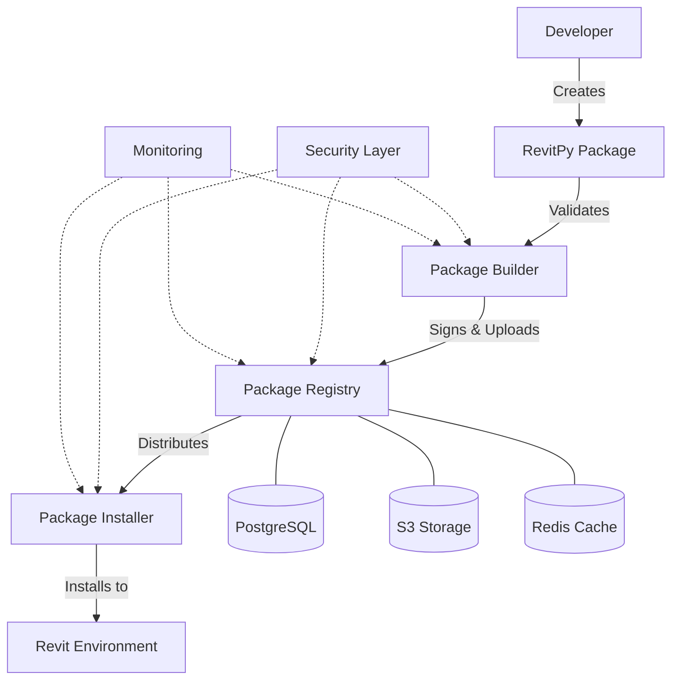

# RevitPy Package Manager Documentation

Welcome to the comprehensive documentation for **RevitPy Package Manager** - the enterprise-grade package management system that revolutionizes how you develop, distribute, and manage Python extensions for Autodesk Revit.

{ align=right width=200 }

## What is RevitPy Package Manager?

RevitPy Package Manager is a complete package management ecosystem designed specifically for the RevitPy framework. It provides developers with modern, reliable tools for creating, distributing, and managing Python packages that integrate seamlessly with Autodesk Revit.

### Key Features

=== "🚀 Developer Experience"

    - **Modern CLI Tools**: Intuitive command-line interface for all package operations
    - **Smart Dependency Resolution**: Automatic handling of complex dependency graphs
    - **Isolated Environments**: Virtual environment management for conflict-free development
    - **Hot Reload Support**: Rapid development with instant code updates

=== "🔒 Enterprise Security"

    - **Package Signing**: Cryptographic verification of package integrity
    - **Vulnerability Scanning**: Automated security analysis of packages and dependencies
    - **Access Control**: Role-based permissions for private registries
    - **Audit Logging**: Comprehensive tracking of all package operations

=== "⚡ Performance & Scale"

    - **Intelligent Caching**: Optimized download and installation performance  
    - **CDN Distribution**: Global content delivery for fast package access
    - **Parallel Processing**: Multi-threaded operations for enterprise deployments
    - **Resource Monitoring**: Built-in performance metrics and alerting

=== "🏗️ Production Ready"

    - **High Availability**: 99.9% uptime SLA with redundant infrastructure
    - **Auto Scaling**: Dynamic capacity adjustment based on usage
    - **Monitoring & Alerts**: Comprehensive observability and incident management
    - **Backup & Recovery**: Automated data protection and disaster recovery

## Quick Navigation

-   :material-clock-fast:{ .lg .middle } __Getting Started__

    ---

    New to RevitPy? Start here for installation, setup, and your first package.

    [:octicons-arrow-right-24: Installation Guide](getting-started/installation.md)

-   :material-school:{ .lg .middle } __Tutorials__

    ---

    Step-by-step tutorials covering everything from basic scripting to advanced topics.

    [:octicons-arrow-right-24: Basic Scripting](tutorials/basic-scripting.md)

-   :material-swap-horizontal:{ .lg .middle } __Migration Guide__

    ---

    Moving from PyRevit? Our comprehensive guide makes the transition seamless.

    [:octicons-arrow-right-24: Migrate from PyRevit](guides/migration-from-pyrevit.md)

-   :material-api:{ .lg .middle } __API Reference__

    ---

    Complete API documentation with examples and best practices.

    [:octicons-arrow-right-24: Registry API](reference/api/registry.md)

-   :material-office-building:{ .lg .middle } __Enterprise__

    ---

    Deploy and manage RevitPy at scale with enterprise features.

    [:octicons-arrow-right-24: Deployment Guide](enterprise/deployment.md)

-   :material-account-group:{ .lg .middle } __Community__

    ---

    Join our vibrant community and contribute to the RevitPy ecosystem.

    [:octicons-arrow-right-24: Contributing](community/contributing.md)

## Architecture Overview

RevitPy Package Manager consists of four core components working together to provide a seamless experience:

### Component Overview

| Component | Purpose | Key Features |
|-----------|---------|--------------|
| **Package Builder** | Create and validate packages | Validation, signing, compilation |
| **Package Registry** | Store and distribute packages | Web UI, REST API, access control |
| **Package Installer** | Install and manage packages | Virtual environments, dependency resolution |
| **Security Layer** | Ensure package safety | Signing verification, vulnerability scanning |

## Use Cases

### For Individual Developers
- Rapid prototyping of Revit automation scripts
- Sharing utilities and tools with the community
- Managing dependencies across multiple projects
- Testing packages before deployment

### For Teams & Organizations
- Collaborative development with shared package repositories
- Standardized development environments across team members
- Automated testing and deployment pipelines
- Code review and approval workflows

### For Enterprise
- Secure, private package registries behind corporate firewalls
- Integration with existing DevOps and CI/CD infrastructure
- Compliance with security policies and audit requirements
- Scalable deployment across global development teams

## What's New in v0.1.0

!!! tip "Latest Release"
    Version 0.1.0 introduces the core package management functionality with enterprise-ready features.

### 🎉 New Features
- Complete package registry with REST API
- Advanced dependency resolution engine
- Package signing and verification
- Virtual environment management
- Comprehensive CLI tools

### 🔧 Developer Experience
- Intuitive CLI with rich terminal output
- Automatic Revit version compatibility detection
- Hot reload development mode
- Comprehensive error messages and troubleshooting

### 🏢 Enterprise Features
- Private registry deployment options
- Role-based access control
- Audit logging and compliance reporting
- High availability configuration

## Community & Support

### Get Help
- **Documentation**: You're reading it! Comprehensive guides and references
- **Community Forum**: [forum.revitpy.dev](https://forum.revitpy.dev) for questions and discussions
- **Discord**: [discord.gg/revitpy](https://discord.gg/revitpy) for real-time chat
- **GitHub Issues**: [Report bugs and request features](https://github.com/highvelocitysolutions/revitpy/issues)

### Stay Updated
- **Newsletter**: Subscribe for release updates and community highlights
- **Blog**: [blog.revitpy.dev](https://blog.revitpy.dev) for in-depth articles and tutorials
- **Social Media**: Follow [@revitpy](https://twitter.com/revitpy) on Twitter

## Contributing

RevitPy is an open-source project that thrives on community contributions. Whether you're fixing bugs, adding features, or improving documentation, we welcome your help!

[Get started with contributing](community/contributing.md){ .md-button .md-button--primary }

## License & Legal

RevitPy Package Manager is released under the MIT License, allowing both personal and commercial use. See our [license page](https://github.com/highvelocitysolutions/revitpy/blob/main/LICENSE) for full details.

For enterprise licensing, support contracts, and custom development, contact us at [enterprise@revitpy.dev](mailto:enterprise@revitpy.dev).

---

**Ready to get started?** Jump into our [installation guide](getting-started/installation.md) and create your first RevitPy package in minutes!