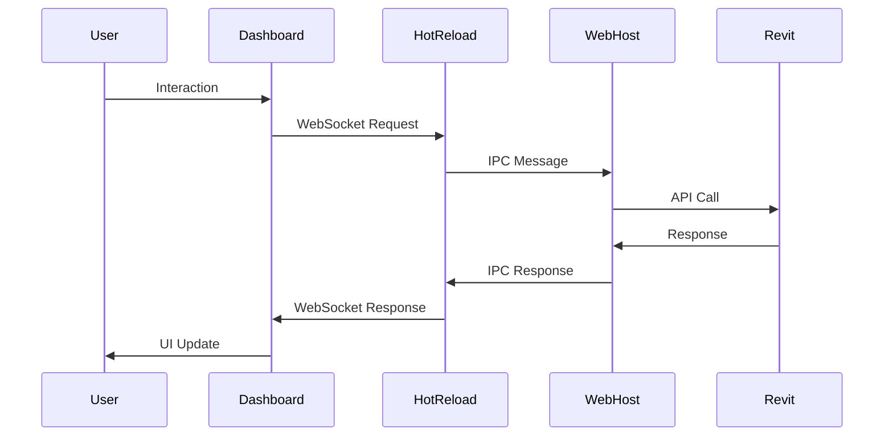
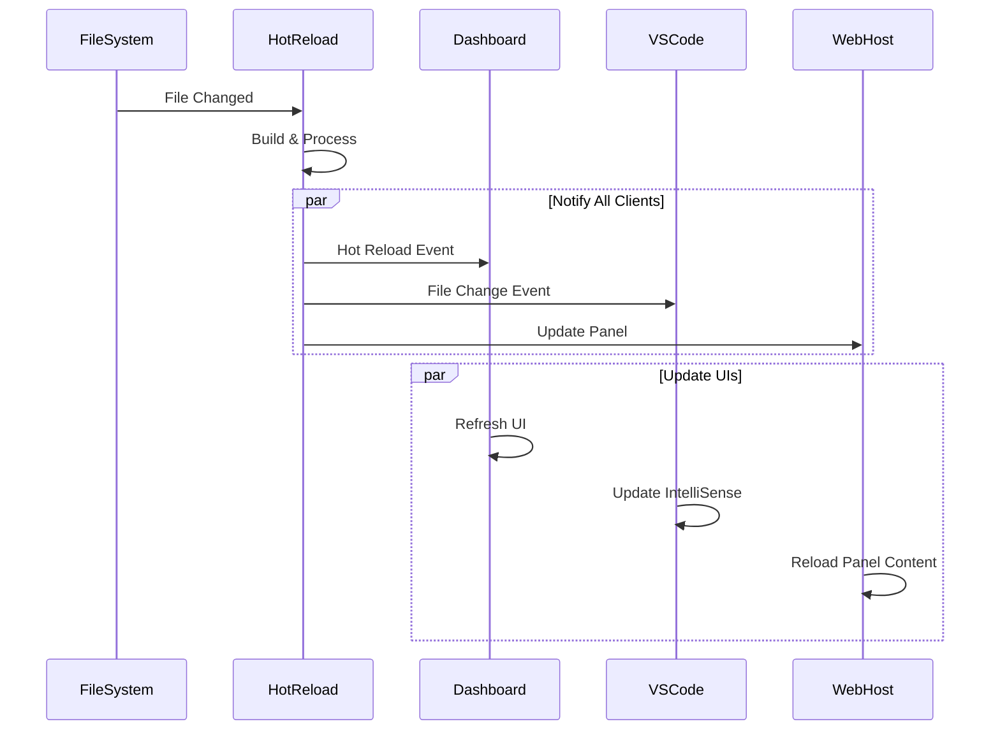

# RevitPy Developer Tools Architecture

This document provides a comprehensive overview of the architecture and design decisions behind the RevitPy Developer Tools suite.

## System Overview

The RevitPy Developer Tools are built as a distributed system with multiple interconnected components that work together to provide a seamless development experience.

```
┌─────────────────────────────────────────────────────────────────────┐
│                           RevitPy Ecosystem                        │
├─────────────────────────────────────────────────────────────────────┤
│                                                                     │
│  ┌─────────────────┐  ┌─────────────────┐  ┌─────────────────────┐ │
│  │   VS Code       │  │     Browser     │  │       Revit         │ │
│  │   Extension     │  │   Applications  │  │    Application      │ │
│  └─────────────────┘  └─────────────────┘  └─────────────────────┘ │
│           │                     │                       │          │
│  ┌─────────────────┐  ┌─────────────────┐  ┌─────────────────────┐ │
│  │  Language       │  │   Web Apps      │  │   WebView2 Host     │ │
│  │  Server         │  │   (React)       │  │      (.NET)         │ │
│  └─────────────────┘  └─────────────────┘  └─────────────────────┘ │
│           │                     │                       │          │
│           └─────────────────────┼─────────────────────────┘        │
│                                 │                                   │
│  ┌─────────────────────────────────────────────────────────────────┐ │
│  │              Hot Reload Development Server                      │ │
│  │                         (Node.js)                              │ │
│  └─────────────────────────────────────────────────────────────────┘ │
│                                 │                                   │
│  ┌─────────────────────────────────────────────────────────────────┐ │
│  │                    Package Registry                             │ │
│  │                      (REST API)                                │ │
│  └─────────────────────────────────────────────────────────────────┘ │
│                                                                     │
└─────────────────────────────────────────────────────────────────────┘
```

## Architecture Principles

### 1. Microservices Architecture

Each component is designed as an independent service with well-defined interfaces:

- **Loose Coupling**: Components communicate through standardized APIs
- **High Cohesion**: Each service has a single, well-defined responsibility
- **Independent Deployment**: Services can be updated independently
- **Technology Diversity**: Each service uses the best technology for its purpose

### 2. Event-Driven Communication

Services communicate through events and message passing:

- **WebSocket Connections**: Real-time bidirectional communication
- **Message Brokers**: Reliable message delivery and routing
- **Event Sourcing**: Maintain audit trails and enable replay
- **CQRS Pattern**: Separate read and write operations

### 3. Modern Web Standards

Built on current web technologies and standards:

- **ES Modules**: Native JavaScript module system
- **WebComponents**: Reusable, encapsulated components
- **Service Workers**: Offline-first architecture
- **Progressive Enhancement**: Graceful degradation for older browsers

## Component Architecture

### React Dashboard (`apps/dashboard`)

**Technology Stack:**
- **React 18** with concurrent features
- **TypeScript** for type safety
- **Vite** for fast development and building
- **TanStack Query** for data fetching
- **Zustand** for state management
- **Tailwind CSS** for styling

**Architecture Pattern: Flux/Redux**

```
┌─────────────────────────────────────────────────────────────┐
│                      Dashboard App                          │
├─────────────────────────────────────────────────────────────┤
│                                                             │
│  ┌─────────────┐  ┌─────────────┐  ┌─────────────────────┐  │
│  │    Pages    │  │  Components │  │       Hooks         │  │
│  │             │  │             │  │                     │  │
│  │ • Dashboard │  │ • Layout    │  │ • useRevitPy        │  │
│  │ • Projects  │  │ • Forms     │  │ • useProjects       │  │
│  │ • Packages  │  │ • Charts    │  │ • usePackages       │  │
│  │ • Settings  │  │ • Tables    │  │ • useSettings       │  │
│  └─────────────┘  └─────────────┘  └─────────────────────┘  │
│                                                             │
├─────────────────────────────────────────────────────────────┤
│                                                             │
│  ┌─────────────┐  ┌─────────────┐  ┌─────────────────────┐  │
│  │   Stores    │  │  Providers  │  │      Services       │  │
│  │             │  │             │  │                     │  │
│  │ • RevitPy   │  │ • Theme     │  │ • API Client        │  │
│  │ • Projects  │  │ • Toast     │  │ • WebSocket         │  │
│  │ • Packages  │  │ • Query     │  │ • Storage           │  │
│  │ • UI        │  │ • Router    │  │ • Analytics         │  │
│  └─────────────┘  └─────────────┘  └─────────────────────┘  │
│                                                             │
└─────────────────────────────────────────────────────────────┘
```

**Key Design Patterns:**
- **Container/Presenter**: Separate data logic from presentation
- **Hooks Pattern**: Custom hooks for reusable stateful logic
- **Provider Pattern**: Context providers for global state
- **Compound Components**: Complex components with multiple parts

### UI Component Library (`packages/ui`)

**Architecture Pattern: Atomic Design**

```
┌─────────────────────────────────────────────────────────────┐
│                   UI Component Library                     │
├─────────────────────────────────────────────────────────────┤
│                                                             │
│  ┌─────────────┐  ┌─────────────┐  ┌─────────────────────┐  │
│  │   Atoms     │  │  Molecules  │  │     Organisms       │  │
│  │             │  │             │  │                     │  │
│  │ • Button    │  │ • Form      │  │ • Header            │  │
│  │ • Input     │  │ • Card      │  │ • Sidebar           │  │
│  │ • Badge     │  │ • Dialog    │  │ • DataTable         │  │
│  │ • Icon      │  │ • Dropdown  │  │ • PerformanceChart  │  │
│  └─────────────┘  └─────────────┘  └─────────────────────┘  │
│                                                             │
├─────────────────────────────────────────────────────────────┤
│                                                             │
│  ┌─────────────┐  ┌─────────────┐  ┌─────────────────────┐  │
│  │   Themes    │  │   Hooks     │  │      Utils          │  │
│  │             │  │             │  │                     │  │
│  │ • Light     │  │ • useTheme  │  │ • cn()              │  │
│  │ • Dark      │  │ • useToast  │  │ • formatters        │  │
│  │ • High      │  │ • useDeboun │  │ • validators        │  │
│  │   Contrast  │  │   ce        │  │ • accessibility     │  │
│  └─────────────┘  └─────────────┘  └─────────────────────┘  │
│                                                             │
└─────────────────────────────────────────────────────────────┘
```

**Design System Features:**
- **Token-based Design**: CSS custom properties for consistency
- **Responsive Design**: Mobile-first approach with breakpoints
- **Accessibility**: WCAG 2.1 AA compliance by default
- **Theme System**: Dynamic theming with CSS variables
- **TypeScript**: Full type safety with variant props

### VS Code Extension (`src/RevitPy.VSCodeExtension`)

**Architecture Pattern: Model-View-Controller**

```
┌─────────────────────────────────────────────────────────────┐
│                   VS Code Extension                        │
├─────────────────────────────────────────────────────────────┤
│                                                             │
│  ┌─────────────┐  ┌─────────────┐  ┌─────────────────────┐  │
│  │   Views     │  │ Controllers │  │       Models        │  │
│  │             │  │             │  │                     │  │
│  │ • Project   │  │ • Commands  │  │ • Project           │  │
│  │   Explorer  │  │ • Debug     │  │ • Connection        │  │
│  │ • Package   │  │ • Language  │  │ • Package           │  │
│  │   Manager   │  │   Server    │  │ • Settings          │  │
│  │ • Element   │  │ • Tasks     │  │ • Workspace         │  │
│  │   Inspector │  │ • Providers │  │                     │  │
│  └─────────────┘  └─────────────┘  └─────────────────────┘  │
│                                                             │
├─────────────────────────────────────────────────────────────┤
│                                                             │
│  ┌─────────────┐  ┌─────────────┐  ┌─────────────────────┐  │
│  │  Language   │  │   Debug     │  │     Integration     │  │
│  │   Server    │  │   Adapter   │  │                     │  │
│  │             │  │             │  │ • Revit Connection  │  │
│  │ • Syntax    │  │ • Break     │  │ • Hot Reload        │  │
│  │   Highlight │  │   points    │  │ • Package Registry  │  │
│  │ • IntelliSe │  │ • Variables │  │ • File Watcher      │  │
│  │   nse       │  │ • Call      │  │                     │  │
│  │ • Diagnost  │  │   Stack     │  │                     │  │
│  │   ics       │  │             │  │                     │  │
│  └─────────────┘  └─────────────┘  └─────────────────────┘  │
│                                                             │
└─────────────────────────────────────────────────────────────┘
```

**Extension Features:**
- **Language Server Protocol**: Standardized language support
- **Debug Adapter Protocol**: Standardized debugging interface
- **Tree Data Providers**: Custom views in VS Code sidebar
- **Task Providers**: Integration with VS Code task system
- **Command Palette**: Easy access to extension commands

### Hot Reload Server (`src/RevitPy.HotReload`)

**Architecture Pattern: Event-Driven Architecture**

```
┌─────────────────────────────────────────────────────────────┐
│                 Hot Reload Server                          │
├─────────────────────────────────────────────────────────────┤
│                                                             │
│  ┌─────────────┐  ┌─────────────┐  ┌─────────────────────┐  │
│  │   Watchers  │  │   Builders  │  │    Communicators    │  │
│  │             │  │             │  │                     │  │
│  │ • File      │  │ • TypeScript│  │ • WebSocket Server  │  │
│  │   Watcher   │  │   Compiler  │  │ • Message Broker    │  │
│  │ • Directory │  │ • Python    │  │ • Revit Connector   │  │
│  │   Scanner   │  │   Processor │  │ • Client Manager    │  │
│  │ • Change    │  │ • Asset     │  │                     │  │
│  │   Detector  │  │   Pipeline  │  │                     │  │
│  └─────────────┘  └─────────────┘  └─────────────────────┘  │
│                                                             │
├─────────────────────────────────────────────────────────────┤
│                                                             │
│  ┌─────────────┐  ┌─────────────┐  ┌─────────────────────┐  │
│  │   Event     │  │    Cache    │  │      Plugins        │  │
│  │   System    │  │   Manager   │  │                     │  │
│  │             │  │             │  │ • Build Plugins     │  │
│  │ • Event     │  │ • Memory    │  │ • Transform         │  │
│  │   Emitter   │  │   Cache     │  │   Plugins           │  │
│  │ • Event     │  │ • File      │  │ • Custom Handlers   │  │
│  │   Router    │  │   Cache     │  │ • Middleware        │  │
│  │ • Listeners │  │ • Invalidat │  │                     │  │
│  │             │  │   ion       │  │                     │  │
│  └─────────────┘  └─────────────┘  └─────────────────────┘  │
│                                                             │
└─────────────────────────────────────────────────────────────┘
```

**Server Features:**
- **File System Watching**: Efficient file change detection
- **Build Pipeline**: Configurable build steps and transformations
- **WebSocket Communication**: Real-time bidirectional messaging
- **Plugin Architecture**: Extensible processing pipeline
- **Caching**: Multi-level caching for performance

### WebView2 Host (`src/RevitPy.WebHost`)

**Architecture Pattern: Host-Guest Pattern**

```
┌─────────────────────────────────────────────────────────────┐
│                   WebView2 Host                            │
├─────────────────────────────────────────────────────────────┤
│                                                             │
│  ┌─────────────┐  ┌─────────────┐  ┌─────────────────────┐  │
│  │    Host     │  │    Guest    │  │   Communication     │  │
│  │   (.NET)    │  │    (Web)    │  │                     │  │
│  │             │  │             │  │ • Message Bridge    │  │
│  │ • Panel     │  │ • React App │  │ • Data Binding      │  │
│  │   Manager   │  │ • JavaScript│  │ • Event Routing     │  │
│  │ • Event     │  │   Runtime   │  │ • Serialization     │  │
│  │   Handling  │  │ • DOM API   │  │ • Type Conversion   │  │
│  │ • Resource  │  │             │  │                     │  │
│  │   Management│  │             │  │                     │  │
│  └─────────────┘  └─────────────┘  └─────────────────────┘  │
│                                                             │
├─────────────────────────────────────────────────────────────┤
│                                                             │
│  ┌─────────────┐  ┌─────────────┐  ┌─────────────────────┐  │
│  │  Security   │  │ Performance │  │   Development       │  │
│  │             │  │             │  │                     │  │
│  │ • Sandboxed │  │ • Memory    │  │ • Hot Reload        │  │
│  │   Execution │  │   Management│  │ • Debug Tools       │  │
│  │ • Permission│  │ • Resource  │  │ • Error Handling    │  │
│  │   System    │  │   Pooling   │  │ • Logging           │  │
│  │ • Content   │  │ • Caching   │  │ • Profiling         │  │
│  │   Filtering │  │             │  │                     │  │
│  └─────────────┘  └─────────────┘  └─────────────────────┘  │
│                                                             │
└─────────────────────────────────────────────────────────────┘
```

**Host Features:**
- **Multi-Panel Management**: Handle multiple concurrent panels
- **Security Sandboxing**: Controlled access to host capabilities
- **Memory Management**: Efficient resource allocation and cleanup
- **Hot Reload Integration**: Development-time code updates
- **Performance Monitoring**: Track resource usage and performance

## Data Flow Architecture

### Request-Response Flow



### Event-Driven Updates



## State Management

### Distributed State Architecture

The system uses a distributed state management approach where each component maintains its own state while synchronizing shared state through events and APIs.

**State Categories:**

1. **Local UI State**: Component-specific state (forms, modals, selections)
2. **Application State**: App-wide state (user preferences, current project)
3. **Shared State**: Cross-component state (connection status, project data)
4. **Persistent State**: Stored state (settings, cache, user data)

**State Synchronization:**

```typescript
// Example: Connection status synchronization
interface ConnectionState {
  status: 'connected' | 'connecting' | 'disconnected' | 'error';
  revitVersion?: string;
  lastActivity?: Date;
}

// Dashboard store
const useRevitPyStore = create<ConnectionState>((set) => ({
  status: 'disconnected',
  setStatus: (status) => set({ status }),
  setRevitVersion: (version) => set({ revitVersion: version }),
}));

// WebSocket event handlers
socket.on('connection-status', (data: ConnectionState) => {
  useRevitPyStore.getState().setStatus(data.status);
  useRevitPyStore.getState().setRevitVersion(data.revitVersion);
});
```

## Performance Considerations

### Frontend Performance

**Bundle Optimization:**
- Code splitting at route level
- Dynamic imports for heavy components
- Tree shaking for unused exports
- Bundle analysis and size monitoring

**Runtime Performance:**
- React.memo for expensive components
- Virtual scrolling for large datasets
- Web Workers for CPU-intensive tasks
- Service Workers for caching

**Memory Management:**
- Proper cleanup in useEffect hooks
- Weak references for event listeners
- Image lazy loading and optimization
- Efficient data structures

### Backend Performance

**Server Optimization:**
- HTTP/2 for multiplexed requests
- Gzip compression for responses
- CDN for static assets
- Database connection pooling

**Caching Strategy:**
- Multi-level caching (memory, disk, CDN)
- Cache invalidation strategies
- ETag support for conditional requests
- Browser caching headers

**Resource Management:**
- Connection pooling for WebSockets
- Resource cleanup on disconnect
- Memory leak detection and prevention
- Process monitoring and restart

## Security Architecture

### Authentication & Authorization

```typescript
// Role-based access control
interface UserRole {
  permissions: Permission[];
  resources: Resource[];
}

interface Permission {
  action: 'read' | 'write' | 'execute' | 'admin';
  resource: string;
  conditions?: Condition[];
}

// Example permission check
function canAccess(user: User, resource: string, action: string): boolean {
  return user.roles.some(role =>
    role.permissions.some(permission =>
      permission.resource === resource &&
      permission.action === action &&
      evaluateConditions(permission.conditions, { user, resource })
    )
  );
}
```

### Data Security

- **Input Validation**: Strict validation of all user inputs
- **Output Encoding**: Proper encoding for XSS prevention
- **CSRF Protection**: Token-based CSRF protection
- **SQL Injection**: Parameterized queries only
- **File Upload**: Strict file type and size validation

### Communication Security

- **TLS Encryption**: HTTPS/WSS for all communications
- **Message Signing**: Digital signatures for critical messages
- **Rate Limiting**: Prevent abuse and DoS attacks
- **Input Sanitization**: Clean all external inputs

## Monitoring & Observability

### Logging Strategy

```typescript
// Structured logging
interface LogEntry {
  timestamp: Date;
  level: 'debug' | 'info' | 'warn' | 'error';
  component: string;
  message: string;
  context?: Record<string, unknown>;
  userId?: string;
  sessionId?: string;
  requestId?: string;
}

// Example logger usage
logger.info('User action completed', {
  action: 'project-create',
  projectId: 'proj-123',
  userId: 'user-456',
  duration: 1250, // ms
  success: true
});
```

### Metrics Collection

- **Performance Metrics**: Response times, throughput, error rates
- **Business Metrics**: User engagement, feature usage, conversion rates
- **System Metrics**: CPU, memory, disk usage, network I/O
- **Custom Metrics**: Domain-specific measurements

### Error Handling

```typescript
// Global error boundary
class ErrorBoundary extends React.Component {
  componentDidCatch(error: Error, errorInfo: ErrorInfo) {
    // Log error with context
    logger.error('React error boundary caught error', {
      error: error.message,
      stack: error.stack,
      componentStack: errorInfo.componentStack,
      userId: getCurrentUserId(),
      sessionId: getSessionId(),
      url: window.location.href
    });

    // Send to error reporting service
    errorReporter.captureException(error, {
      tags: { boundary: 'react' },
      extra: errorInfo
    });
  }
}
```

## Scalability Considerations

### Horizontal Scaling

- **Stateless Services**: Enable horizontal scaling
- **Load Balancing**: Distribute traffic across instances
- **Service Discovery**: Dynamic service registration
- **Circuit Breakers**: Prevent cascade failures

### Vertical Scaling

- **Resource Optimization**: Efficient memory and CPU usage
- **Connection Pooling**: Reuse expensive connections
- **Caching**: Reduce computational overhead
- **Lazy Loading**: Load resources on demand

### Data Scaling

- **Database Sharding**: Distribute data across shards
- **Read Replicas**: Scale read operations
- **Caching Layers**: Redis for session and application cache
- **CDN**: Distribute static assets globally

## Testing Strategy

### Testing Pyramid

1. **Unit Tests** (70%): Individual component testing
2. **Integration Tests** (20%): Component interaction testing
3. **End-to-End Tests** (10%): Full user journey testing

### Testing Tools

- **Unit Testing**: Vitest, Jest, React Testing Library
- **Component Testing**: Storybook, Chromatic
- **Integration Testing**: Playwright, Cypress
- **Performance Testing**: Lighthouse CI, WebPageTest
- **Accessibility Testing**: axe-core, WAVE

## Deployment Architecture

### Development Environment

```yaml
# docker-compose.dev.yml
version: '3.8'
services:
  dashboard:
    build: ./apps/dashboard
    ports: ['3000:3000']
    environment:
      - NODE_ENV=development
      - VITE_HOT_RELOAD=true
    volumes:
      - ./apps/dashboard/src:/app/src

  package-registry:
    build: ./apps/package-registry
    ports: ['3001:3001']
    depends_on: [postgres, redis]

  hot-reload-server:
    build: ./src/RevitPy.HotReload
    ports: ['3002:3002']
    volumes:
      - /var/run/docker.sock:/var/run/docker.sock
```

### Production Environment

```yaml
# kubernetes deployment
apiVersion: apps/v1
kind: Deployment
metadata:
  name: revitpy-dashboard
spec:
  replicas: 3
  selector:
    matchLabels:
      app: revitpy-dashboard
  template:
    metadata:
      labels:
        app: revitpy-dashboard
    spec:
      containers:
      - name: dashboard
        image: revitpy/dashboard:latest
        ports:
        - containerPort: 3000
        env:
        - name: NODE_ENV
          value: production
        resources:
          requests:
            memory: "256Mi"
            cpu: "100m"
          limits:
            memory: "512Mi"
            cpu: "500m"
```

## Future Architecture Considerations

### Microservices Evolution

- **Service Mesh**: Implement Istio for service communication
- **API Gateway**: Centralized API management and routing
- **Event Streaming**: Apache Kafka for real-time event processing
- **Container Orchestration**: Advanced Kubernetes features

### Cloud-Native Features

- **Serverless Functions**: AWS Lambda for event-driven processing
- **Managed Databases**: Cloud-native database services
- **Global Distribution**: Multi-region deployment strategy
- **Auto-scaling**: Dynamic resource allocation based on demand

This architecture provides a solid foundation for building scalable, maintainable, and performant developer tools while maintaining flexibility for future enhancements and requirements.
